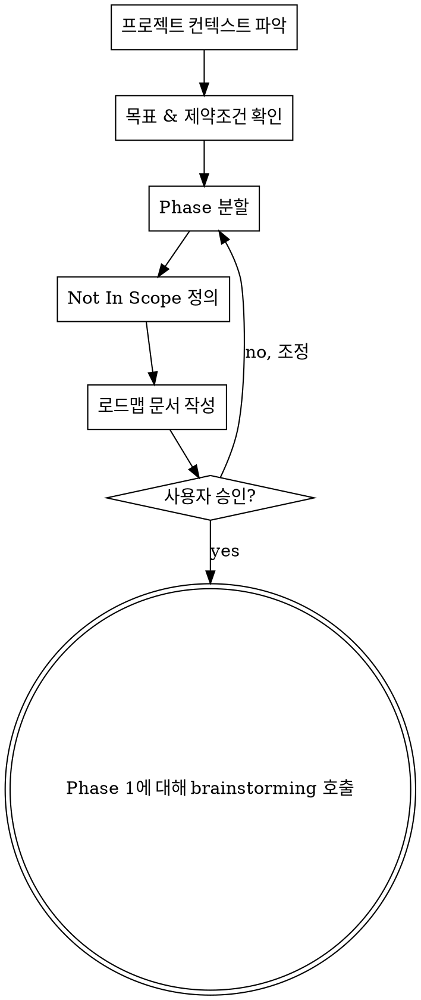

# Superpowers v1.3.0 — Experience-Driven Improvements Design

> **For Claude:** REQUIRED SUB-SKILL: Use superpowers:team-driven-development for parallel agent team execution, or superpowers:executing-plans for sequential batch execution in a separate session.

**Goal:** 110개 세션, 2,251개 메시지, 310시간의 실전 사용 경험에서 도출된 마찰 패턴을 해결하여 superpowers의 워크플로우 품질을 한 단계 끌어올린다.

**Architecture:** 기존 파이프라인(brainstorming → writing-plans → team-driven-development)의 철학과 Hard Gate 패턴을 유지하면서, 5개 영역을 개선한다: (1) brainstorming 전 프로젝트 범위 설정, (2) 워커 목표 주입 + 셀프 체크 루프, (3) 감사 reject 추적 시스템, (4) TDD 준수 강제 강화, (5) 직접 대화 세션의 승인 게이트.

**Tech Stack:** Markdown skills, Claude Code plugin system

**Version:** 1.2.0 → 1.3.0

---

## 설계 원칙

이번 개선은 다음 원칙을 따른다:

1. **기존 파이프라인 보존** — 현재 워크플로우의 순서와 Hard Gate는 변경하지 않는다. 새로운 단계를 삽입하거나 기존 단계를 강화할 뿐이다.
2. **실전 마찰 기반** — 가설이 아닌 실제 세션 데이터(12회 '잘못된 접근', 8회 '사용자 행동 거부', 1회 '커밋 오염')에서 도출된 개선만 포함한다.
3. **스킬 레벨 해결 우선** — 훅보다 스킬에서 해결한다. 스킬은 컨텍스트를 이해하고 예외 처리가 가능하지만, 훅은 맹목적이다.
4. **워커 자율성 + 검증 루프** — 워커에게 더 명확한 목표를 주되, 마이크로매니징하지 않는다. 대신 셀프 체크 → 감사 체크리스트의 2중 검증으로 품질을 보장한다.
5. **YAGNI** — 인사이트가 제안한 "자기 치유 파이프라인", "병렬 가설 디버깅" 등 미래 지향적 기능은 이번 범위에서 제외한다. 현재 검증된 마찰만 해결한다.

---

## 변경된 전체 파이프라인

```
v1.2.0:
  brainstorming → writing-plans → team-driven-development → finishing-branch

v1.3.0:
  project-scoping (NEW, 대규모 프로젝트 시)
    → brainstorming (Phase별 반복)
      → writing-plans
        → team-driven-development (목표 주입 + 셀프 체크 + reject 추적 강화)
          → finishing-branch
```

직접 대화 세션에서는 using-superpowers의 Direct Conversation Rule이 적용되어, 코드 변경 전 계획 제시 → 승인 → 실행 순서가 강제된다.

---

## 설계 1: `project-scoping` — 신규 스킬

### 배경

brainstorming 스킬은 세부 스펙 정의에 탁월하지만, 대규모 프로젝트(15+ 태스크)에서는 전체 진행 단계를 먼저 파악하는 것이 선행되어야 한다. 실전에서 21개 태스크 QaJira 구현, 15개 태스크 파이프라인 재설계 등 대규모 세션이 빈번했으나, 전체 로드맵 없이 brainstorming에 바로 진입하여 범위 파악이 어려웠다.

### 트리거 조건

다음 중 하나에 해당하면 project-scoping을 먼저 실행:
- 신규 프로젝트 시작
- 대규모 리팩토링 (예상 태스크 10개 이상)
- 대규모 코드 리뷰에서 도출된 수정 작업 (이슈 10개 이상)
- 사용자가 `/project-scoping` 명시적 호출

### 스킬 위치

```
skills/project-scoping/SKILL.md
commands/project-scoping.md (disable-model-invocation: true)
```

### 프로세스



**Step 1: 프로젝트 컨텍스트 파악**
- 기존 코드베이스 구조 확인 (files, docs, CLAUDE.md)
- 기술 스택 파악
- 최근 커밋 히스토리 확인
- 기존 docs/api/ 확인

**Step 2: 목표 & 제약조건 확인**
- 사용자와 대화하여 프로젝트의 최종 목표 확인
- 기술적 제약조건 (기존 스키마 유지, 하위호환 등)
- 비즈니스 제약조건 (일정, 우선순위)
- 질문은 한 번에 하나씩, 가능하면 선택지 제공

**Step 3: Phase 분할**
- 전체 프로젝트를 2~6개 Phase로 분할
- 각 Phase에 다음 정보 정의:
  - **목표**: 한 문장으로 이 Phase가 달성하는 것
  - **범위**: 영향받는 모듈/디렉토리
  - **예상 태스크 수**: 대략적 규모 (brainstorming에서 구체화)
  - **선행 조건**: 이전 Phase 완료 여부 또는 외부 의존성
- Phase 간 의존성 그래프 확인

**Step 4: Not In Scope 정의**
- 이번 프로젝트에서 하지 않을 것을 명시
- 범위 확장 방지의 핵심

**Step 5: 로드맵 문서 작성**
- `docs/plans/YYYY-MM-DD-<project>-roadmap.md`에 저장
- git commit

**Step 6: 전환**
- 승인 후 첫 번째 Phase에 대해 brainstorming 스킬 호출
- 이후 Phase는 이전 Phase 완료 후 순차적으로 brainstorming 진행

### 로드맵 문서 형식

```markdown
# <Project Name> Roadmap

> Created: YYYY-MM-DD
> Status: Active

## 목표
<프로젝트의 최종 목표 1-2문장>

## 제약조건
- <기술적/비즈니스 제약>

## Phase 1: <Phase 이름>
- **목표**: <한 문장>
- **범위**: <모듈/디렉토리>
- **예상 태스크 수**: N개
- **선행 조건**: 없음

## Phase 2: <Phase 이름>
- **목표**: <한 문장>
- **범위**: <모듈/디렉토리>
- **예상 태스크 수**: N개
- **선행 조건**: Phase 1 완료

## Not In Scope
- <하지 않을 것 목록>
```

### Hard Gate

```
<HARD-GATE>
project-scoping의 출력물은 로드맵(Phase/목표/범위)뿐이다.
세부 스펙, API 설계, 데이터 모델 등은 brainstorming에서 다룬다.
"이 Phase는 간단하니 바로 스펙으로" → STOP. 모든 Phase는 brainstorming을 거친다.
</HARD-GATE>
```

### 연동 변경

**using-superpowers 수정:**
- Skill Priority에 project-scoping 추가
- "대규모 프로젝트/리팩토링/리뷰 수정" 감지 시 project-scoping 먼저 안내

**brainstorming 수정:**
- 로드맵이 존재하면 해당 Phase의 범위 내에서만 brainstorming 진행
- "Phase N의 brainstorming입니다. 로드맵: docs/plans/...-roadmap.md" 맥락 주입

---

## 설계 2: 에이전트 목표 주입 — 3중 검증 루프

### 배경

실전에서 발견된 핵심 문제:
- 워커가 태스크를 수행하지만 기능이 절반만 구현됨
- 테스트는 통과하지만 실제 비즈니스 로직이 누락됨
- 잘못된 방향으로 구현하여 감사 후 전면 재작업
- 감사 에이전트가 "코드 변경 있음 + 테스트 통과" 수준으로만 검증

원인 분석: 워커에게 **"무엇을 왜 하는지"**가 아닌 **"무엇을 하는지"**만 전달됨. 감사도 구조적 체크(파일 변경됨, 테스트 통과)에 치중하고 의미적 검증(목표 달성됨)이 약함.

### 변경 대상

1. `skills/team-driven-development/setup-guide.md` — TaskCreate 메타데이터 확장
2. `skills/team-driven-development/worker-spawn-template.md` — 목표 주입 + 셀프 체크
3. `agents/audit-agent.md` — Goal Verification 섹션 추가

### 변경 1: setup-guide.md — TaskCreate 메타데이터 확장

현재 TaskCreate의 metadata에 `target_files`만 있다. 여기에 목표 관련 필드 추가:

```
For each task in plan:
  TaskCreate:
    subject: "<task title>"
    description: "<full task requirements>"
    activeForm: "<present continuous form>"
    metadata: {
      "target_files": ["src/auth.ts", "src/auth.test.ts"],
      "model": "opus",
      "goal": "<이 태스크가 완료되면 무엇이 달성되는가 — 한 문장>",
      "success_criteria": [
        "<검증 가능한 성공 기준 1>",
        "<검증 가능한 성공 기준 2>",
        "<검증 가능한 성공 기준 3>"
      ],
      "verification_method": "<구체적 검증 방법: 테스트 명, curl 명령, UI 확인 등>"
    }
```

**success_criteria 작성 원칙:**
- 모호한 기준 금지: "잘 동작함" ✗ → "POST /api/login 시 200 + JWT 반환" ✓
- 검증 가능해야 함: 테스트, curl, UI 조작 등으로 확인 가능
- 에러 케이스 포함: 정상 + 비정상 모두 기술
- 3-7개 범위: 너무 적으면 누락, 너무 많으면 태스크 분할 필요

### 변경 2: worker-spawn-template.md — 목표 주입 + 셀프 체크

현재 MANDATORY WORKFLOW 6단계를 다음으로 대체:

```
GOAL:
  <metadata.goal에서 추출>

SUCCESS CRITERIA:
  1. <metadata.success_criteria[0]>
  2. <metadata.success_criteria[1]>
  3. <metadata.success_criteria[2]>

VERIFICATION METHOD:
  <metadata.verification_method에서 추출>

MANDATORY WORKFLOW:
  0. UNDERSTAND: Goal과 Success Criteria를 읽고, 자신의 말로 정리하여
     Team Lead에게 SendMessage로 보고한다.
     "Task N 이해 완료: [자신의 말로 정리한 목표]"
     Team Lead가 이해가 틀렸다고 판단하면 교정한다.

  1. PLAN: 구현 계획을 3-5단계로 수립한다 (코드 작성 전).
     각 단계가 어떤 success criteria를 충족시키는지 매핑한다.

  2. CHECK docs/api/: API 계약 확인
     - relevant docs 존재 → source of truth로 사용
     - docs 미존재 → docs/api/[domain].md 생성
     (REQUIRED SUB-SKILL: superpowers:api-edr-validation)

  3. RED: 실패하는 테스트 작성 → 실행하여 실패 확인
     (REQUIRED SUB-SKILL: superpowers:test-driven-development)

  4. GREEN: 테스트 통과하는 최소 코드 작성 → 실행하여 통과 확인

  5. REFACTOR: 필요시 정리 (테스트 그린 유지)

  6. 3-5 반복 (다음 기능/success criteria)

  7. SELF-CHECK: Success Criteria 전체를 하나씩 대조 확인한다.
     결과를 다음 형식으로 정리:
     ```
     SELF-CHECK RESULT:
     - [✅/❌] 기준 1: <확인 방법과 결과>
     - [✅/❌] 기준 2: <확인 방법과 결과>
     - [✅/❌] 기준 3: <확인 방법과 결과>
     - Verification: <verification_method 실행 결과>
     - Tests: N개 통과 / N개 전체
     ```
     ❌가 하나라도 있으면 → 3-5로 돌아가서 해결 후 재체크.

  8. REPORT: audit-agent에게 Task Completion Report 제출.
     기존 보고 형식에 SELF-CHECK RESULT를 포함한다:
     - Goal: <목표>
     - Self-Check: <위의 체크 결과>
     - What Was Done (bullet list)
     - Files Changed (paths + description)
     - Tests (count, all passing yes/no, command used)
     - API Contracts (documented in docs/api/)
     - Commits (hashes and messages)

  9. If audit-agent rejects: fix and resubmit (step 3부터)
  10. NEVER mark task complete yourself
```

**Step 0의 의도:** 워커가 목표를 잘못 이해한 채 작업하는 것을 방지. Team Lead가 초기에 교정 가능.

### 변경 3: audit-agent.md — Goal Verification 추가

현재 Verification Checklist에 4개 섹션(Spec Compliance, Code Quality, API Consistency, Git Hygiene)이 있다. 맨 앞에 Goal Verification을 추가:

```markdown
### 0. Goal Verification (최우선 확인)

- [ ] 워커의 SELF-CHECK RESULT를 수신했는가
- [ ] 워커의 셀프 체크에 ❌가 없는가
- [ ] Success Criteria를 실제 코드 변경(git diff)과 대조하여 모두 충족되었는가
- [ ] "테스트 통과"만으로 완료 판정하지 않았는가 — success criteria 각각을 독립적으로 확인
- [ ] verification_method를 감사 측에서도 확인 가능한가 (테스트 실행, diff 확인 등)

**Red Flag:** 워커가 "테스트 모두 통과"만 보고하고 SELF-CHECK RESULT가 없으면 → REJECT
**Red Flag:** success_criteria의 일부만 충족되었으면 → REJECT (부분 완료 불허)
```

### Audit Report Format 변경

기존 형식에 Goal Verification 섹션 추가:

```markdown
## Audit Report — Task N

**Status:** APPROVED / REJECTED
**Worker:** <worker-name>
**Task:** <task title>
**Goal:** <task goal>

### Goal Verification
- [✅/❌] Success Criteria 1: <검증 결과>
- [✅/❌] Success Criteria 2: <검증 결과>
- [✅/❌] Success Criteria 3: <검증 결과>
- [✅/❌] Verification Method: <검증 결과>
- [✅/❌] Self-Check 제출됨

### Spec Compliance
(기존과 동일)

### Code Quality
(기존과 동일)

### TDD Compliance (NEW — 설계 4에서 상세)
- [ ] 테스트가 구현 전에 작성되었는가 (커밋 순서)
- [ ] 테스트가 실제 기능을 검증하는가 (stub/empty 아닌지)
- [ ] success criteria와 테스트가 대응하는가

### API Consistency
(기존과 동일)

### Git Hygiene
(기존과 동일)
```

---

## 설계 3: LLM 실수/오작동 추적 — Reject 로깅 시스템

### 배경

에이전트의 실수는 불가피하다. 그러나 어떤 유형의 실수가 반복되는지 추적하지 않으면 지속적 개선이 불가능하다. 현재는 reject가 발생해도 워커-감사 간 메시지로만 존재하여, 세션 종료 후 사라진다.

### 설계 결정

- **기록 대상**: 감사 에이전트의 모든 REJECT
- **기록 위치**: `docs/audit-log.md` (프로젝트 내)
- **활용 방식**: 사용자에게 reject 사유 안내 + 프로젝트 종료 시 요약 리포트
- **워커 자동 주입 안 함**: 사용자 요청에 따라 제외. 기록은 되되 워커에게 참조시키지 않음

### audit-agent.md 변경

reject 시 기존 통신 프로토콜에 로깅 단계 추가:

```markdown
### When Rejecting

1. (기존) SendMessage to worker: "AUDIT REJECTED — ..."
2. (기존) SendMessage to Team Lead: "Task N REJECTED. ..."
3. (NEW) docs/audit-log.md에 reject 기록 추가:

   ```markdown
   ### [YYYY-MM-DD HH:MM] Task N — <worker-name>
   - **유형**: <아래 분류 중 택 1>
   - **상세**: <구체적 reject 사유>
   - **영향 받은 Success Criteria**: <해당 기준>
   ```

   **Reject 유형 분류:**
   | 유형 | 설명 |
   |------|------|
   | `기능 미구현` | success criteria의 일부가 구현되지 않음 |
   | `잘못된 방향` | 구현은 되었으나 요구사항과 다른 방향 |
   | `테스트만 통과` | 테스트는 통과하지만 실제 기능이 동작하지 않음 |
   | `스펙 누락` | success criteria에 없는 부분이 누락됨 (criteria 자체의 문제) |
   | `API 불일치` | docs/api/ 계약과 다르게 구현 |
   | `TDD 미준수` | 테스트 작성 없이 코드 구현, 또는 stub 테스트 |
   | `범위 초과` | target_files 외 파일 수정, 또는 요청 외 기능 추가 |
```

### orchestration-loop.md 변경

AUDIT RESULT 단계에 Team Lead의 사용자 리포트 추가:

```
7. AUDIT RESULT:
   - If audit-agent APPROVES:
     (기존과 동일)
   - If audit-agent REJECTS:
     a. Forward rejection feedback to worker
     b. (NEW) Report to user:
        "audit-agent가 Task N을 reject했습니다.
        유형: <reject 유형>
        사유: <한 줄 요약>
        워커에게 수정 지시를 전달했습니다."
     c. Go to step 5 (wait for worker's fix)
```

### 최종 감사 시 요약 리포트

audit-agent.md의 Final Comprehensive Audit에 추가:

```markdown
6. **Reject Summary** (NEW):
   docs/audit-log.md를 분석하여 요약 리포트를 Team Lead에게 제출:
   ```
   REJECT SUMMARY:
   - 총 reject: N건
   - 유형별:
     - 기능 미구현: N건
     - 잘못된 방향: N건
     - 테스트만 통과: N건
     - ...
   - 가장 빈번한 유형: <유형> (N건)
   ```
   Team Lead는 이 요약을 사용자에게 전달한다.
```

---

## 설계 4: TDD 준수 강제 강화

### 배경

TDD 스킬이 존재하고 worker-spawn-template에 TDD가 명시되어 있지만, 실전에서 워커가:
- 코드를 먼저 작성하고 테스트를 나중에 추가
- stub 테스트만 작성하고 통과 보고
- 테스트를 작성하지만 실제 기능과 무관한 테스트

이를 감사 레벨에서 검증할 수 있도록 체크 항목을 추가한다.

### 변경 대상

설계 2의 worker-spawn-template 변경에 이미 TDD 순서(Step 3-5: RED → GREEN → REFACTOR)가 포함되어 있다. 여기에 추가로:

### audit-agent.md — TDD Compliance 섹션 추가

```markdown
### TDD Compliance

- [ ] 워커의 커밋 히스토리에서 테스트가 구현 코드보다 먼저 커밋되었는가
      (커밋 순서: test → impl → refactor 패턴 확인)
- [ ] 테스트가 실제 기능을 검증하는가:
      - 빈 테스트(assert true) 아닌지
      - stub 구현을 테스트하는 것이 아닌지
      - success criteria와 1:1 대응하는 테스트가 있는지
- [ ] 전체 테스트 스위트가 통과하는가 (워커 보고 수치 vs 실제 실행)
```

**검증 방법:**
- `git log --oneline`으로 커밋 순서 확인
- `git diff` 또는 파일 읽기로 테스트 내용 확인
- 테스트 파일에 success criteria 키워드가 있는지 확인

### worker-spawn-template 추가 지침

셀프 체크(Step 7)에 TDD 관련 항목 추가:

```
7. SELF-CHECK:
   Success Criteria:
   - [✅/❌] 기준 1: ...
   - [✅/❌] 기준 2: ...

   TDD Compliance:
   - [✅/❌] 모든 기능에 대해 테스트를 먼저 작성했는가
   - [✅/❌] 각 테스트가 실패하는 것을 확인한 후 구현했는가
   - [✅/❌] success criteria마다 대응하는 테스트가 있는가
```

---

## 설계 5: 직접 대화 세션의 승인 게이트

### 배경

인사이트 데이터에서 가장 비용이 큰 마찰: "사용자가 질문만 했는데 Claude가 바로 코드 수정까지 진행" → 전체 revert 강제 → 세션 낭비.

이 문제는 team-driven-development의 워커가 아닌, **사용자와 직접 대화하는 세션**에서 발생한다.

### 설계 결정: 훅이 아닌 스킬 레벨에서 해결

**훅 방식의 문제점:**
- PostToolUse(Edit/Write) 훅은 team-driven의 워커에게도 트리거됨
- 워커는 오케스트레이터의 지시를 받아 코드를 작성하므로, 매번 경고가 뜨면 자동 프로세스가 방해받음
- 훅에서 "직접 대화 세션 vs 팀 워크플로우 워커"를 구분하기 어려움

**스킬 방식의 장점:**
- using-superpowers 스킬은 세션 시작 시 로드되므로, 컨텍스트를 이해함
- "사용자와 직접 대화 중인가?" 판단 가능
- 예외 처리 가능 ("바로 수정해줘" 같은 명시적 즉시 실행 요청)

### using-superpowers 수정

기존 스킬에 다음 섹션 추가:

```markdown
## Direct Conversation Rule

사용자와 직접 대화하는 세션에서 (team-driven-development의 워커가 아닌 경우):

<HARD-GATE>
코드 변경(Edit, Write, NotebookEdit)이 필요한 요청을 받으면:
1. 먼저 분석 결과와 변경 계획을 제시한다
2. 사용자의 명시적 승인("진행해", "go ahead", "approved", "해줘" 등)을 기다린다
3. 승인 후에만 Edit/Write/NotebookEdit를 실행한다

"간단한 수정"도 예외 없이 이 순서를 따른다.
"사용자가 수정을 요청했으니 바로 하면 된다" → STOP. 계획 제시가 먼저다.
</HARD-GATE>

**예외 (이 규칙이 적용되지 않는 경우):**
- team-driven-development 내 워커 에이전트 (오케스트레이터가 관리)
- 사용자가 "바로 수정해줘", "즉시 적용해" 등 명시적 즉시 실행 요청
- 오타 수정, 한 줄 변경 등 사용자가 구체적 변경 내용을 직접 지정한 경우

**Red Flags:**
| 생각 | 현실 |
|------|------|
| "사용자가 수정 요청했으니 바로 하자" | 요청 ≠ 승인. 계획 제시가 먼저. |
| "이건 한 줄 수정이라 계획이 필요 없다" | 한 줄도 계획 제시 → 승인 → 실행. |
| "물어보면 답과 함께 수정하는 게 빠르다" | 사용자는 답만 원했을 수 있다. 수정은 별도 승인. |
| "이전에 비슷한 수정을 승인했으니" | 이전 승인 ≠ 현재 승인. 매번 확인. |
```

### optimize-claude-md 수정

권장 CLAUDE.md 구조에 `## Workflow Protocol` 섹션 추가 안내:

```markdown
## Workflow Protocol
<!-- 코드 변경 전 계획 제시 및 승인 규칙. 상세는 superpowers:using-superpowers 참조 -->
Always present a modification plan and get explicit user approval BEFORE implementing any code changes.
```

---

## 변경 파일 요약

| # | 파일 | 변경 유형 | 설계 |
|---|------|----------|------|
| 1 | `skills/project-scoping/SKILL.md` | 신규 | 설계 1 |
| 2 | `commands/project-scoping.md` | 신규 | 설계 1 |
| 3 | `skills/using-superpowers/SKILL.md` | 수정 | 설계 1 + 5 |
| 4 | `skills/brainstorming/SKILL.md` | 수정 | 설계 1 |
| 5 | `skills/team-driven-development/setup-guide.md` | 수정 | 설계 2 |
| 6 | `skills/team-driven-development/worker-spawn-template.md` | 수정 | 설계 2 + 4 |
| 7 | `agents/audit-agent.md` | 수정 | 설계 2 + 3 + 4 |
| 8 | `skills/team-driven-development/orchestration-loop.md` | 수정 | 설계 3 |
| 9 | `commands/optimize-claude-md.md` | 수정 | 설계 5 |

**신규 파일: 2개** | **수정 파일: 7개** | **삭제 파일: 0개**

---

## 범위 밖 (이번 버전에서 제외)

- **자기 치유(Self-Healing) 파이프라인**: 인사이트 "미래 전망"에서 제안. 워커 자동 revert + 재시도. v1.4.0에서 검토.
- **병렬 가설 디버깅 스킬**: systematic-debugging에 이미 Phase 5(Team Debugging Mode)가 있으므로 별도 스킬 불필요. 필요시 competing-hypotheses.md 개선으로 대응.
- **서버 빌드/재시작 자동화**: 프로젝트별 설정. optimize-claude-md에서 Workflow Protocol 안내만.
- **PostToolUse 훅**: 스킬 레벨에서 해결(설계 5). 훅은 워커 영향 우려.
- **워커에게 실수 이력 자동 주입**: 사용자 요청에 따라 제외. 기록만 하고 워커에게는 주입하지 않음.

---

## 버전 변경

- `plugin.json`: 1.2.0 → 1.3.0
- `marketplace.json`: 1.1.1 → 1.3.0
- `RELEASE-NOTES.md`: v1.3.0 엔트리 추가
