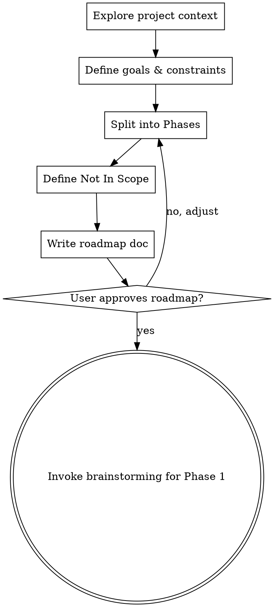

# v1.3.0 Experience-Driven Improvements Implementation Plan

> **For Claude:** REQUIRED SUB-SKILL: Use superpowers:team-driven-development for parallel agent team execution, or superpowers:executing-plans for sequential batch execution in a separate session.

**Goal:** 실전 사용 경험에서 도출된 5개 개선 영역을 구현하여 superpowers v1.2.0 → v1.3.0 업그레이드

**Architecture:** 신규 스킬 2개 생성(project-scoping SKILL.md + command), 기존 스킬/에이전트 7개 수정, 버전 메타데이터 업데이트. Markdown 파일만 변경하며 코드 없음.

**Tech Stack:** Markdown, YAML frontmatter, Claude Code plugin system

**Design Doc:** `docs/plans/2026-02-26-v1.3.0-experience-driven-improvements-design.md`

---

## 태스크 의존성 그래프

```
Task 1 (project-scoping SKILL.md)  ──┬──→ Task 3 (using-superpowers 수정)
Task 2 (project-scoping command)   ──┘    Task 4 (brainstorming 수정) ← Task 1

Task 5 (setup-guide 메타데이터)    ──→ Task 6 (worker-spawn-template) ──→ Task 7 (audit-agent)
                                                                           ↓
Task 8 (orchestration-loop)  ← ─────────────────────────────────────── Task 7
Task 9 (optimize-claude-md)         (독립)

Task 10 (버전 + RELEASE-NOTES)  ← 전체 완료 후
```

**병렬 실행 가능 그룹:**
- Wave 1: Task 1, 2, 5, 9 (독립적)
- Wave 2: Task 3, 4, 6 (Wave 1 완료 후)
- Wave 3: Task 7 (Wave 2의 Task 6 완료 후)
- Wave 4: Task 8 (Wave 3 완료 후)
- Wave 5: Task 10 (전체 완료 후)

---

### Task 1: `project-scoping` 스킬 생성

**Files:**
- Create: `skills/project-scoping/SKILL.md`

**Goal:** brainstorming 전 단계에서 프로젝트 전체 Phase/범위를 설정하는 신규 스킬 생성

**Success Criteria:**
1. YAML frontmatter에 name, description 정의됨
2. HARD-GATE: 세부 스펙은 brainstorming에서 다루며, 이 스킬은 로드맵만 출력
3. 6단계 프로세스 (컨텍스트 파악 → 목표/제약 → Phase 분할 → Not In Scope → 로드맵 문서 → brainstorming 전환) 포함
4. 로드맵 문서 형식(Phase별 목표/범위/예상태스크수/선행조건) 정의됨
5. 트리거 조건(신규 프로젝트, 대규모 리팩토링, 대규모 리뷰 수정) 명시됨
6. 터미널 상태: brainstorming 스킬 호출 (다른 스킬 호출 금지)

**Verification Method:** 스킬 파일 구조가 기존 brainstorming/SKILL.md와 동일한 패턴(frontmatter, overview, HARD-GATE, checklist, process flow, red flags) 따르는지 확인

**Step 1: 스킬 디렉토리 생성 및 SKILL.md 작성**

```markdown
---
name: project-scoping
description: "Use when starting a new project, large-scale refactoring, or large review-driven fixes — defines project roadmap with Phases before brainstorming begins"
---

# Project Scoping — Roadmap Before Details

## Overview

대규모 프로젝트에서 brainstorming이 곧바로 세부 스펙으로 들어가는 것을 방지한다.
전체 프로젝트를 Phase로 나누고, 각 Phase의 목표·범위·예상 규모·선행 조건을 정의한 후
brainstorming으로 전환한다.

**Announce at start:** "I'm using the project-scoping skill to define the project roadmap before diving into details."

<HARD-GATE>
이 스킬의 출력물은 로드맵(Phase/목표/범위)뿐이다.
세부 스펙, API 설계, 데이터 모델, 구현 상세는 brainstorming에서 다룬다.
"이 Phase는 간단하니 바로 스펙으로" → STOP. 모든 Phase는 brainstorming을 거친다.
"Phase가 1개뿐이면 이 스킬이 불필요하다" → STOP. 1개라도 목표·범위·Not In Scope를 명확히 한다.
</HARD-GATE>

## When to Use

다음 중 하나에 해당하면 brainstorming 전에 이 스킬을 먼저 실행:
- **신규 프로젝트** 시작
- **대규모 리팩토링** (예상 태스크 10개 이상)
- **대규모 코드 리뷰 수정** (이슈 10개 이상에서 도출된 수정 작업)
- **사용자가 `/project-scoping` 명시적 호출**

다음에는 사용하지 않음:
- 단일 버그 수정, 단일 기능 추가 → brainstorming으로 직행
- 이미 로드맵이 존재하는 프로젝트의 후속 Phase 진행

## Checklist

You MUST create a task for each of these items and complete them in order:

1. **Explore project context** — 기존 코드, docs, CLAUDE.md, 기술 스택, 최근 커밋 확인
2. **Define goals & constraints** — 프로젝트 최종 목표, 기술적/비즈니스 제약, 우선순위 확인 (질문은 한 번에 하나씩)
3. **Split into Phases** — 2~6개 Phase 분할, 각각에 목표/범위/예상 태스크 수/선행 조건 정의
4. **Define Not In Scope** — 이번 프로젝트에서 하지 않을 것 명시
5. **Write roadmap doc** — `docs/plans/YYYY-MM-DD-<project>-roadmap.md`에 저장, git commit
6. **Transition to brainstorming** — 첫 번째 Phase에 대해 brainstorming 스킬 호출

## Process Flow



**The terminal state is invoking brainstorming for Phase 1.** Do NOT invoke writing-plans, team-driven-development, or any implementation skill. The ONLY skill you invoke after project-scoping is brainstorming.

## The Process

**Exploring context:**
- Check out the current project state (files, docs, CLAUDE.md, recent commits)
- Identify tech stack, existing architecture, key modules
- Check if docs/api/ exists and review existing contracts

**Defining goals & constraints:**
- Ask one question at a time to clarify the project's ultimate goal
- Identify technical constraints (existing schema, backward compatibility, etc.)
- Identify business constraints (timeline, priorities, resources)
- Prefer multiple choice questions when possible

**Splitting into Phases:**
- Each Phase should be independently deliverable (shippable increment)
- Phase boundaries should align with natural system boundaries (modules, layers)
- Each Phase should have a clear goal achievable in one brainstorming + implementation cycle
- Estimate task count roughly (brainstorming will refine)
- Define dependencies between Phases

**Defining Not In Scope:**
- Explicitly list what this project will NOT do
- This prevents scope creep during brainstorming and implementation
- Be specific: "모바일 앱" not "기타 기능"

## Roadmap Document Format

```markdown
# <Project Name> Roadmap

> Created: YYYY-MM-DD
> Status: Active

## 목표
<프로젝트의 최종 목표 1-2문장>

## 제약조건
- <기술적 제약>
- <비즈니스 제약>

## Phase 1: <Phase 이름>
- **목표**: <한 문장 — 이 Phase가 완료되면 무엇이 달성되는가>
- **범위**: <영향받는 모듈/디렉토리>
- **예상 태스크 수**: N개
- **선행 조건**: 없음

## Phase 2: <Phase 이름>
- **목표**: <한 문장>
- **범위**: <모듈/디렉토리>
- **예상 태스크 수**: N개
- **선행 조건**: Phase 1 완료

## Not In Scope
- <하지 않을 것 1>
- <하지 않을 것 2>
```

## After the Roadmap

**Phase별 진행:**
- 로드맵 승인 후, Phase 1부터 순차적으로 brainstorming → writing-plans → team-driven-development 진행
- 각 Phase 완료 후 다음 Phase의 brainstorming 시작
- brainstorming 시 로드맵 문서를 참조하여 해당 Phase의 범위 내에서만 진행

## Key Principles

- **로드맵은 전체 그림** — 세부는 brainstorming에서
- **Phase는 독립 배포 단위** — 각 Phase가 끝나면 동작하는 결과물
- **One question at a time** — 질문은 하나씩
- **Not In Scope가 핵심** — 범위 밖을 정의해야 범위 안이 명확해짐
- **2~6 Phases** — 너무 적으면 의미 없고, 너무 많으면 로드맵 자체가 복잡

## Red Flags — STOP and Follow Process

| Thought | Reality |
|---------|---------|
| "Phase가 1개뿐이다" | 1개라도 목표/범위/Not In Scope를 명확히 한다. |
| "이 Phase의 세부 스펙을 여기서 정하자" | 세부 스펙은 brainstorming의 몫. 로드맵은 목표/범위만. |
| "바로 brainstorming 해도 될 것 같다" | 대규모 프로젝트면 로드맵 먼저. 범위 없이 설계하면 범위 초과. |
| "Phase 간 의존성이 복잡하다" | Phase를 재분할하거나 합쳐서 단순화한다. |
| "Not In Scope는 나중에 정하자" | Not In Scope는 지금 정해야 한다. 나중에 정하면 이미 범위에 들어왔다. |
```

**Step 2: Commit**

```bash
git add skills/project-scoping/SKILL.md
git commit -m "feat: add project-scoping skill for roadmap before brainstorming"
```

---

### Task 2: `project-scoping` 커맨드 생성

**Files:**
- Create: `commands/project-scoping.md`

**Goal:** `/project-scoping` 명시적 호출을 위한 커맨드 파일 생성

**Success Criteria:**
1. YAML frontmatter에 description과 disable-model-invocation: true 설정
2. 스킬 호출 지시 포함

**Verification Method:** 기존 commands/brainstorm.md 패턴과 동일한 구조인지 확인

**Step 1: 기존 커맨드 패턴 확인**

Read: `commands/brainstorm.md` — 구조 확인

**Step 2: 커맨드 파일 작성**

```markdown
---
description: "Define project roadmap with Phases before brainstorming — use for new projects, large refactoring, or large review-driven fixes"
disable-model-invocation: true
---

# /project-scoping

프로젝트의 전체 로드맵을 정의합니다. brainstorming 전에 Phase, 목표, 범위, Not In Scope를 설정합니다.

## 실행

`superpowers:project-scoping` 스킬을 호출하여 프로세스를 시작합니다.
```

**Step 3: Commit**

```bash
git add commands/project-scoping.md
git commit -m "feat: add /project-scoping command"
```

---

### Task 3: `using-superpowers` 수정 — project-scoping 연동 + Direct Conversation Rule

**Files:**
- Modify: `skills/using-superpowers/SKILL.md`

**Goal:** (1) Skill Priority에 project-scoping 추가, (2) Direct Conversation Rule 추가

**Success Criteria:**
1. Skill Priority에 project-scoping이 brainstorming 전 단계로 명시됨
2. Direct Conversation Rule이 HARD-GATE로 추가됨
3. 예외 조건(team-driven 워커, 명시적 즉시 실행 요청, 구체적 한 줄 변경 지정) 포함
4. Red Flags 테이블에 관련 항목 추가됨

**Verification Method:** 스킬 전체 읽어서 기존 섹션과 충돌 없는지 확인

**Step 1: Skill Priority 섹션 수정**

현재 (line 77-86):
```markdown
## Skill Priority

When multiple skills could apply, use this order:

1. **Process skills first** (brainstorming, debugging) - these determine HOW to approach the task
2. **Team & validation skills second** ...
```

변경:
```markdown
## Skill Priority

When multiple skills could apply, use this order:

1. **Scoping skills first** (project-scoping) - for large projects, define roadmap before details
2. **Process skills second** (brainstorming, debugging) - these determine HOW to approach the task
3. **Team & validation skills third** (team-driven-development, api-edr-validation, model-assignment) - these set up execution infrastructure
4. **Implementation skills fourth** (frontend-design, mcp-builder) - these guide execution
5. **Quality gate skills always** (audit-verification, context-window-management) - these run continuously

"Let's build X" (large project) → project-scoping first, then brainstorming per Phase, then team setup.
"Let's build X" (small feature) → brainstorming first, then team setup with audit agent.
"Fix this bug" → debugging first, then domain-specific skills.
"Execute this plan" → team-driven-development with mandatory audit gates.
```

**Step 2: Direct Conversation Rule 섹션 추가**

User Instructions 섹션(line 113-115) 뒤에 추가:

```markdown
## Direct Conversation Rule

사용자와 직접 대화하는 세션에서 (team-driven-development의 워커가 아닌 경우):

<HARD-GATE>
코드 변경(Edit, Write, NotebookEdit)이 필요한 요청을 받으면:
1. 먼저 분석 결과와 변경 계획을 제시한다
2. 사용자의 명시적 승인("진행해", "go ahead", "approved", "해줘" 등)을 기다린다
3. 승인 후에만 Edit/Write/NotebookEdit를 실행한다

"간단한 수정"도 예외 없이 이 순서를 따른다.
"사용자가 수정을 요청했으니 바로 하면 된다" → STOP. 계획 제시가 먼저다.
</HARD-GATE>

**예외 (이 규칙이 적용되지 않는 경우):**
- team-driven-development 내 워커 에이전트 (오케스트레이터가 관리)
- 사용자가 "바로 수정해줘", "즉시 적용해" 등 명시적 즉시 실행 요청
- 오타 수정 등 사용자가 구체적 변경 내용을 직접 지정한 경우

| Thought | Reality |
|---------|---------|
| "사용자가 수정 요청했으니 바로 하자" | 요청 ≠ 승인. 계획 제시가 먼저. |
| "이건 한 줄 수정이라 계획이 필요 없다" | 한 줄도 계획 제시 → 승인 → 실행. |
| "물어보면 답과 함께 수정하는 게 빠르다" | 사용자는 답만 원했을 수 있다. |
| "이전에 비슷한 수정을 승인했으니" | 이전 승인 ≠ 현재 승인. 매번 확인. |
```

**Step 3: Commit**

```bash
git add skills/using-superpowers/SKILL.md
git commit -m "feat: add project-scoping priority and direct conversation rule to using-superpowers"
```

---

### Task 4: `brainstorming` 수정 — 로드맵 인식 추가

**Files:**
- Modify: `skills/brainstorming/SKILL.md`

**Goal:** 로드맵이 존재할 때 해당 Phase 범위 내에서만 brainstorming 진행하도록 맥락 주입

**Success Criteria:**
1. Overview 또는 Process 섹션에 로드맵 인식 지침 추가됨
2. 로드맵 존재 시 Phase 범위를 벗어나지 않도록 제약 명시됨
3. 기존 프로세스 흐름과 충돌 없음

**Verification Method:** 기존 brainstorming 체크리스트 및 프로세스 흐름이 보존되었는지 확인

**Step 1: Overview 뒤에 Roadmap Context 섹션 추가**

현재 Overview (line 8-12) 뒤, HARD-GATE (line 14) 전에 추가:

```markdown
## Roadmap Context

프로젝트 로드맵(`docs/plans/*-roadmap.md`)이 존재하면:
- **Phase 범위 내에서만** brainstorming을 진행한다
- 세션 시작 시 "Phase N의 brainstorming입니다. 로드맵: `docs/plans/...-roadmap.md`" 맥락을 안내한다
- 해당 Phase의 목표·범위·선행 조건을 참조하여 범위 초과를 방지한다
- 로드맵이 없으면 기존과 동일하게 진행 (project-scoping 없이 단독 brainstorming)
```

**Step 2: Commit**

```bash
git add skills/brainstorming/SKILL.md
git commit -m "feat: add roadmap context awareness to brainstorming skill"
```

---

### Task 5: `setup-guide` 수정 — TaskCreate 메타데이터 확장

**Files:**
- Modify: `skills/team-driven-development/setup-guide.md`

**Goal:** TaskCreate 시 goal, success_criteria, verification_method 메타데이터를 필수로 등록

**Success Criteria:**
1. TaskCreate 예시에 goal, success_criteria, verification_method 필드 추가됨
2. success_criteria 작성 원칙(검증 가능, 에러 케이스 포함, 3-7개) 명시됨
3. 기존 target_files, model 메타데이터는 유지됨

**Verification Method:** setup-guide의 TaskCreate 예시가 설계 문서의 형식과 일치하는지 확인

**Step 1: Step 1 섹션의 TaskCreate 예시 수정**

현재 (line 13-21):
```
For each task in plan:
  TaskCreate:
    subject: "<task title>"
    description: "<full task requirements including target files>"
    activeForm: "<present continuous form>"
    metadata: { "target_files": ["src/auth.ts", "src/auth.test.ts"] }
```

변경:
```
For each task in plan:
  TaskCreate:
    subject: "<task title>"
    description: "<full task requirements including target files>"
    activeForm: "<present continuous form>"
    metadata: {
      "target_files": ["src/auth.ts", "src/auth.test.ts"],
      "model": "opus",
      "goal": "<이 태스크가 완료되면 무엇이 달성되는가 — 한 문장>",
      "success_criteria": [
        "<검증 가능한 성공 기준 1>",
        "<검증 가능한 성공 기준 2>",
        "<검증 가능한 성공 기준 3>"
      ],
      "verification_method": "<구체적 검증 방법: 테스트 명, curl 명령, UI 확인 등>"
    }
```

**Step 2: success_criteria 작성 원칙 추가**

TaskCreate 예시 아래에:

```markdown
**CRITICAL — goal/success_criteria metadata:**
Every task MUST declare goal, success_criteria, and verification_method.
Workers use these for self-check, and Audit Agent verifies against them.

**success_criteria 작성 원칙:**
- 모호한 기준 금지: "잘 동작함" ✗ → "POST /api/login 시 200 + JWT 반환" ✓
- 검증 가능해야 함: 테스트, curl, UI 조작 등으로 확인할 수 있어야 한다
- 에러 케이스 포함: 정상 경로 + 비정상 경로 모두 기술
- 3-7개 범위: 너무 적으면 누락 위험, 너무 많으면 태스크 분할 필요
```

**Step 3: Commit**

```bash
git add skills/team-driven-development/setup-guide.md
git commit -m "feat: extend TaskCreate metadata with goal, success_criteria, verification_method"
```

---

### Task 6: `worker-spawn-template` 수정 — 목표 주입 + 셀프 체크 + TDD 강제

**Files:**
- Modify: `skills/team-driven-development/worker-spawn-template.md`

**Goal:** (1) Goal/Success Criteria 주입, (2) 10단계 MANDATORY WORKFLOW로 확장 (UNDERSTAND → PLAN → CHECK → RED → GREEN → REFACTOR → SELF-CHECK → REPORT)

**Success Criteria:**
1. Spawn Template에 GOAL, SUCCESS CRITERIA, VERIFICATION METHOD 블록 추가됨
2. MANDATORY WORKFLOW가 Step 0(UNDERSTAND)부터 Step 10까지로 확장됨
3. Step 7(SELF-CHECK)에 success_criteria 대조 + TDD compliance 체크 포함
4. Step 8(REPORT)에 SELF-CHECK RESULT 포함 형식 정의됨
5. 기존 FILE SCOPE RESTRICTION은 유지됨

**Verification Method:** 기존 worker-spawn-template의 모든 요소(API 체크, TDD, 파일 범위, 감사 보고)가 보존되면서 새 단계가 추가되었는지 확인

**Step 1: Spawn Template 섹션 대체**

현재 Spawn Template (line 23-62)를 다음으로 대체:

```markdown
## Spawn Template

```
Task (Worker):
  name: "<role-based-name>"
  subagent_type: "general-purpose"
  model: "<opus or sonnet from task metadata>"
  prompt: |
    You are <role-based-name>. Your SINGLE task:

    Task: <full task text from TaskGet>
    Target files: <list from metadata.target_files>

    GOAL:
      <metadata.goal에서 추출>

    SUCCESS CRITERIA:
      1. <metadata.success_criteria[0]>
      2. <metadata.success_criteria[1]>
      3. <metadata.success_criteria[2]>

    VERIFICATION METHOD:
      <metadata.verification_method에서 추출>

    MANDATORY WORKFLOW:
    0. UNDERSTAND: Goal과 Success Criteria를 읽고, 자신의 말로 정리하여
       Team Lead에게 SendMessage로 보고한다.
       "Task N 이해 완료: [자신의 말로 정리한 목표]"
       Team Lead가 이해가 틀렸다고 판단하면 교정한다.

    1. PLAN: 구현 계획을 3-5단계로 수립한다 (코드 작성 전).
       각 단계가 어떤 success criteria를 충족시키는지 매핑한다.

    2. CHECK docs/api/: API 계약 확인
       - relevant docs exist → use as source of truth
       - no docs for your domain → create docs/api/[domain].md
       (REQUIRED SUB-SKILL: superpowers:api-edr-validation)

    3. RED: 실패하는 테스트 작성 → 실행하여 실패 확인
       (REQUIRED SUB-SKILL: superpowers:test-driven-development)

    4. GREEN: 테스트 통과하는 최소 코드 작성 → 실행하여 통과 확인

    5. REFACTOR: 필요시 정리 (테스트 그린 유지)

    6. Repeat 3-5 for each success criteria / feature

    7. SELF-CHECK: 모든 Success Criteria를 하나씩 대조 확인한다.
       ```
       SELF-CHECK RESULT:
       Success Criteria:
       - [✅/❌] 기준 1: <확인 방법과 결과>
       - [✅/❌] 기준 2: <확인 방법과 결과>
       - [✅/❌] 기준 3: <확인 방법과 결과>
       Verification: <verification_method 실행 결과>
       TDD Compliance:
       - [✅/❌] 모든 기능에 대해 테스트를 먼저 작성했는가
       - [✅/❌] 각 테스트가 실패하는 것을 확인한 후 구현했는가
       - [✅/❌] success criteria마다 대응하는 테스트가 있는가
       Tests: N개 통과 / N개 전체
       ```
       ❌가 하나라도 있으면 → Step 3으로 돌아가서 해결 후 재체크.

    8. REPORT: audit-agent에게 Task Completion Report 제출.
       - Goal: <목표>
       - Self-Check: <위의 SELF-CHECK RESULT>
       - What Was Done (bullet list)
       - Files Changed (paths + description)
       - Tests (count, all passing yes/no, command used)
       - API Contracts (documented in docs/api/)
       - Commits (hashes and messages)

    9. If audit-agent rejects: fix and resubmit (Step 3부터)
    10. NEVER mark task complete yourself — Team Lead handles that after audit approval

    FILE SCOPE RESTRICTION:
    - You may ONLY modify files listed in your target files
    - If you need to modify a file NOT in your target list, STOP and message Team Lead
    - Team Lead will update your task's target_files and check for conflicts before approving
    - NEVER modify files outside your scope — this causes conflicts with other workers

    NEVER assume API shapes or invent variable names — always check docs/api/ first.
  team_name: "<project-name>"
```
```

**Step 2: Commit**

```bash
git add skills/team-driven-development/worker-spawn-template.md
git commit -m "feat: add goal injection, self-check loop, and TDD enforcement to worker template"
```

---

### Task 7: `audit-agent` 수정 — Goal Verification + TDD Compliance + Reject Logging

**Files:**
- Modify: `agents/audit-agent.md`

**Goal:** (1) Goal Verification 섹션 추가, (2) TDD Compliance 섹션 추가, (3) reject 시 audit-log.md 로깅 추가, (4) 최종 감사에 Reject Summary 추가

**Success Criteria:**
1. Verification Checklist 맨 앞에 "0. Goal Verification" 섹션 추가됨
2. Code Quality 뒤에 "TDD Compliance" 섹션 추가됨
3. "When Rejecting" 프로토콜에 audit-log.md 기록 단계 추가됨
4. Reject 유형 분류 테이블(7가지: 기능 미구현, 잘못된 방향, 테스트만 통과, 스펙 누락, API 불일치, TDD 미준수, 범위 초과) 포함됨
5. Final Comprehensive Audit에 "Reject Summary" 단계 추가됨
6. Audit Report Format에 Goal Verification, TDD Compliance 섹션 추가됨
7. 기존 Spec Compliance, Code Quality, API Consistency, Git Hygiene 섹션 보존

**Verification Method:** 기존 audit-agent.md의 모든 체크리스트 항목이 유지되고, 새 섹션이 올바른 위치에 삽입되었는지 확인

**Step 1: Verification Checklist에 Goal Verification 추가**

현재 "### 1. Spec Compliance" (line 22) 앞에 추가:

```markdown
### 0. Goal Verification (최우선 확인)

- [ ] 워커의 SELF-CHECK RESULT를 수신했는가
- [ ] 워커의 셀프 체크에 ❌가 없는가
- [ ] Success Criteria를 실제 코드 변경(git diff)과 대조하여 모두 충족되었는가
- [ ] "테스트 통과"만으로 완료 판정하지 않았는가 — success criteria 각각을 독립 확인
- [ ] verification_method를 감사 측에서도 확인했는가

**Red Flag:** 워커가 SELF-CHECK RESULT 없이 완료 보고 → REJECT
**Red Flag:** success_criteria 일부만 충족 → REJECT (부분 완료 불허)
```

**Step 2: TDD Compliance 섹션 추가**

현재 "### 2. Code Quality" (line 30) 뒤에 추가:

```markdown
### 2.5. TDD Compliance

- [ ] 워커의 커밋 히스토리에서 테스트가 구현 코드보다 먼저 커밋되었는가
- [ ] 테스트가 실제 기능을 검증하는가 (빈 테스트/stub 아닌지)
- [ ] success criteria와 테스트가 1:1 대응하는가
- [ ] 워커의 SELF-CHECK에 TDD Compliance 항목이 모두 ✅인가
```

**Step 3: When Rejecting에 로깅 단계 추가**

현재 "### When Rejecting" (line 91) 블록 뒤에 추가:

```markdown
3. **Log to audit-log.md** (NEW):
   프로젝트의 `docs/audit-log.md`에 reject 기록을 추가한다.
   파일이 없으면 생성한다.

   ```markdown
   ### [YYYY-MM-DD HH:MM] Task N — <worker-name>
   - **유형**: <아래 분류 중 택 1>
   - **상세**: <구체적 reject 사유>
   - **영향 받은 Success Criteria**: <해당 기준>
   ```

   **Reject 유형 분류:**
   | 유형 | 설명 |
   |------|------|
   | `기능 미구현` | success criteria의 일부가 구현되지 않음 |
   | `잘못된 방향` | 구현은 되었으나 요구사항과 다른 방향 |
   | `테스트만 통과` | 테스트는 통과하지만 실제 기능이 동작하지 않음 |
   | `스펙 누락` | success criteria에 없는 부분이 누락됨 |
   | `API 불일치` | docs/api/ 계약과 다르게 구현 |
   | `TDD 미준수` | 테스트 작성 없이 코드 구현, 또는 stub 테스트 |
   | `범위 초과` | target_files 외 파일 수정, 또는 요청 외 기능 추가 |
```

**Step 4: Final Comprehensive Audit에 Reject Summary 추가**

현재 "5. **Completeness**" (line 137) 뒤에 추가:

```markdown
6. **Reject Summary** (NEW):
   `docs/audit-log.md`가 존재하면 분석하여 요약 리포트를 Team Lead에게 제출:
   ```
   REJECT SUMMARY:
   - 총 reject: N건
   - 유형별: 기능 미구현 N건, 잘못된 방향 N건, ...
   - 가장 빈번한 유형: <유형> (N건)
   ```
   Team Lead는 이 요약을 사용자에게 전달한다.
```

**Step 5: Audit Report Format에 새 섹션 추가**

현재 Audit Report Format (line 139-173)에서:
- "### Spec Compliance" 앞에 "### Goal Verification" 추가
- "### Code Quality" 뒤에 "### TDD Compliance" 추가

**Step 6: Commit**

```bash
git add agents/audit-agent.md
git commit -m "feat: add goal verification, TDD compliance, and reject logging to audit-agent"
```

---

### Task 8: `orchestration-loop` 수정 — Reject 사용자 리포트

**Files:**
- Modify: `skills/team-driven-development/orchestration-loop.md`

**Goal:** AUDIT RESULT의 reject 경로에 Team Lead → 사용자 리포트 단계 추가

**Success Criteria:**
1. AUDIT RESULT의 reject 경로에 사용자 리포트 단계 추가됨
2. 리포트 형식: reject 유형 + 한 줄 사유 + 워커 수정 지시 확인
3. 기존 루프 흐름(approve → shutdown → complete, reject → feedback → wait) 보존

**Verification Method:** 오케스트레이션 루프의 전체 흐름이 보존되고, reject 경로에만 변경이 있는지 확인

**Step 1: AUDIT RESULT 섹션의 reject 경로 수정**

현재 (line 46-52):
```
  7. AUDIT RESULT:
     ...
     - If audit-agent REJECTS:
       a. Forward rejection feedback to worker
       b. Go to step 5 (wait for worker's fix)
```

변경:
```
  7. AUDIT RESULT:
     ...
     - If audit-agent REJECTS:
       a. Forward rejection feedback to worker
       b. Report to user (brief):
          "audit-agent가 Task N을 reject했습니다.
          유형: <reject 유형>
          사유: <한 줄 요약>
          워커에게 수정 지시를 전달했습니다."
       c. Go to step 5 (wait for worker's fix)
```

**Step 2: Commit**

```bash
git add skills/team-driven-development/orchestration-loop.md
git commit -m "feat: add user-facing reject report to orchestration loop"
```

---

### Task 9: `optimize-claude-md` 수정 — Workflow Protocol 안내

**Files:**
- Modify: `commands/optimize-claude-md.md`

**Goal:** 권장 CLAUDE.md 구조에 Workflow Protocol 섹션 추가 안내

**Success Criteria:**
1. 권장 구조(Step 3-4)에 `## Workflow Protocol` 섹션 추가됨
2. 기존 구조(Overview, Tech Stack, ..., Troubleshooting) 보존

**Verification Method:** optimize-claude-md의 권장 구조에 새 섹션이 적절한 위치에 추가되었는지 확인

**Step 1: 권장 구조에 Workflow Protocol 추가**

현재 권장 구조 (line 88-117)에서 `## Overview` 뒤에 추가:

```markdown
## Workflow Protocol
<!-- 코드 변경 전 계획 제시 및 승인 규칙 -->
Always present a modification plan and get explicit user approval BEFORE implementing any code changes.
```

**Step 2: Commit**

```bash
git add commands/optimize-claude-md.md
git commit -m "feat: add Workflow Protocol to recommended CLAUDE.md structure"
```

---

### Task 10: 버전 업데이트 + RELEASE-NOTES

**Files:**
- Modify: `.claude-plugin/plugin.json`
- Modify: `.claude-plugin/marketplace.json`
- Modify: `RELEASE-NOTES.md`

**Goal:** v1.2.0 → v1.3.0 버전 업데이트 및 릴리즈 노트 작성

**Success Criteria:**
1. plugin.json의 version이 "1.3.0"으로 변경됨
2. marketplace.json의 version이 "1.3.0"으로 변경됨
3. RELEASE-NOTES.md에 v1.3.0 섹션이 추가되어 5개 개선 영역 요약됨

**Verification Method:** 두 JSON 파일의 버전이 일치하고, RELEASE-NOTES.md의 최신 항목이 v1.3.0인지 확인

**Step 1: plugin.json 수정**

`"version": "1.2.0"` → `"version": "1.3.0"`

**Step 2: marketplace.json 수정**

`"version": "1.1.1"` → `"version": "1.3.0"`

**Step 3: RELEASE-NOTES.md에 v1.3.0 추가**

파일 최상단(기존 첫 번째 버전 항목 앞)에 추가:

```markdown
## v1.3.0 (2026-02-27) — Experience-Driven Improvements

실전 110세션(2,251 메시지, 310시간) 사용 경험에서 도출된 마찰 패턴을 해결하는 업데이트.

### New Skills
- **project-scoping**: brainstorming 전 프로젝트 로드맵(Phase/목표/범위) 설정 스킬
- **/project-scoping** command: 명시적 호출 지원

### Enhanced Worker Workflow
- **Goal Injection**: 워커 스폰 시 goal, success_criteria, verification_method 주입
- **Self-Check Loop**: 워커가 작업 완료 전 성공 기준 하나하나 셀프 체크 후 감사에 제출
- **10-Step Mandatory Workflow**: UNDERSTAND → PLAN → CHECK → RED → GREEN → REFACTOR → SELF-CHECK → REPORT

### Enhanced Audit Agent
- **Goal Verification**: success criteria 기반 의미적 검증 (구조적 체크를 넘어서)
- **TDD Compliance**: 테스트 선행 작성 여부, stub 테스트 감지, success criteria-테스트 대응 확인
- **Reject Logging**: reject 시 유형 분류 + docs/audit-log.md 누적 기록 + 사용자 안내
- **Reject Summary**: 프로젝트 종료 시 reject 통계 리포트

### Direct Conversation Rule
- using-superpowers에 HARD-GATE 추가: 직접 대화 시 코드 변경 전 계획 제시 → 승인 → 실행 강제
- team-driven-development 워커는 제외 (오케스트레이터가 관리)

### Other Improvements
- brainstorming: 로드맵 존재 시 Phase 범위 내 brainstorming 강제
- using-superpowers: Skill Priority에 project-scoping 추가 (brainstorming 전 단계)
- optimize-claude-md: 권장 CLAUDE.md 구조에 Workflow Protocol 섹션 추가
- setup-guide: TaskCreate 메타데이터에 goal/success_criteria/verification_method 필수화
- orchestration-loop: reject 시 사용자에게 유형+사유 리포트

### Design Documents
- `docs/plans/2026-02-26-v1.3.0-experience-driven-improvements-design.md`
- `docs/plans/2026-02-26-v1.3.0-experience-driven-improvements-implementation.md`
```

**Step 4: Commit**

```bash
git add .claude-plugin/plugin.json .claude-plugin/marketplace.json RELEASE-NOTES.md
git commit -m "chore: bump version to 1.3.0"
```

---

## 실행 요약

| Wave | Tasks | 병렬 가능 | 예상 변경량 |
|------|-------|-----------|------------|
| 1 | Task 1, 2, 5, 9 | Yes (4 workers) | 신규 2파일 + 수정 2파일 |
| 2 | Task 3, 4, 6 | Yes (3 workers) | 수정 3파일 |
| 3 | Task 7 | Single | 수정 1파일 (가장 큰 변경) |
| 4 | Task 8 | Single | 수정 1파일 (소규모) |
| 5 | Task 10 | Single | 수정 3파일 (버전 + 릴리즈) |

**총 변경: 신규 2파일 + 수정 9파일**
