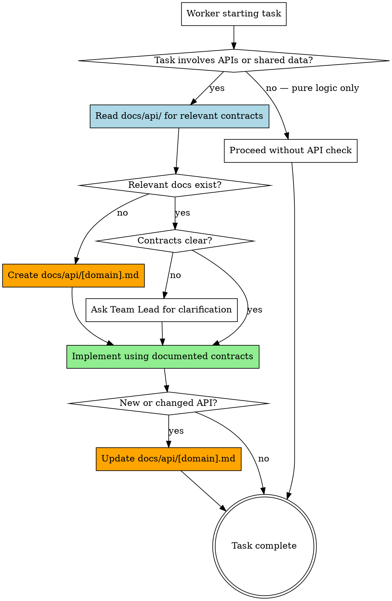

# API/EDR Validation

## Overview

Code-writing agents frequently invent API endpoints, variable names, and request/response shapes without checking documentation. This causes cross-task inconsistencies and broken integrations. This skill forces code-writing workers to check `docs/api/` for all API contracts and variable declarations before writing any code.

**Core principle:** `docs/api/` 디렉토리의 문서가 single source of truth. 모든 에이전트가 직접 참조합니다. No code-writing agent declares API endpoints, EDR variables, or shared data structures without checking `docs/api/` first.

**Announce at start:** "I'm using the api-edr-validation skill to confirm API contracts before coding."

<HARD-GATE>
Every code-writing agent MUST check `docs/api/` BEFORE writing any API-related code.
- No endpoint can be implemented without checking `docs/api/` first
- No API shape can be assumed or invented — it must come from `docs/api/`
- No new endpoint can be implemented without creating its `docs/api/[domain].md` entry
- "I already know the API shape" is NEVER a valid reason to skip checking `docs/api/`

Violation of this gate means the task CANNOT pass audit verification.
</HARD-GATE>

## When to Use

- Before implementing any task that involves API calls or endpoint creation
- Before creating or using EDR variables and event schemas
- Before declaring shared variables, types, or data models
- When modifying existing API contracts or variable names
- When uncertain about request/response shapes
- When creating a new API endpoint (to document it in `docs/api/`)
- When modifying an existing API endpoint (to update its documentation)
- **Any time you are about to write code that references an API or declares a variable used across boundaries**

## The Validation Process



## Validation Steps for Workers

### 1. Check `docs/api/` for Existing Contracts

Before writing any API-related code, read the relevant files in `docs/api/`:

```
docs/api/
├── auth.md              # Authentication endpoints
├── users.md             # User management endpoints
├── payments.md          # Payment endpoints
├── events.md            # EDR / event schemas
└── shared-types.md      # Shared type definitions
```

Search for:
1. What endpoints/events are relevant to your task?
2. What are the exact request/response schemas?
3. What shared variables/types should you use?
4. Are there any constraints or edge cases documented?

### 2. Create API Documentation (New Endpoints)

If no documentation exists for the API domain you're implementing, create `docs/api/[domain].md` using the standard format below **before** writing implementation code.

### 3. Update API Documentation (Changed Endpoints)

If you modify an existing API endpoint, update the corresponding `docs/api/[domain].md` to reflect the changes. Add a changelog entry at the top of the file.

## API Document Standard Format

Every file in `docs/api/` follows this format:

```markdown
# [Domain] API

> Last updated: YYYY-MM-DD
> Updated by: [agent name or task reference]

## Changelog
- YYYY-MM-DD: [description of change]

## Endpoints

### [METHOD] [path]

**Description:** [what this endpoint does]

**Request:**
| Field | Type | Required | Description |
|-------|------|----------|-------------|
| field | type | yes/no   | description |

**Response (200):**
```json
{
  "field": "type — description"
}
```

**Error Responses:**
| Code | Description |
|------|-------------|
| 400  | [when this happens] |
| 401  | [when this happens] |
| 404  | [when this happens] |

---

## Events

### [event-type]

**Trigger:** [what causes this event]
**Payload:**
```json
{
  "field": "type — description"
}
```

---

## Shared Types

### [TypeName]
```typescript
interface TypeName {
  field: type; // description
}
```

**Used by:** [list of endpoints/events that use this type]
```

## EDR Document Management

For Event-Driven Records (events, webhooks, pub/sub):

1. Document event schemas in `docs/api/events.md` or domain-specific files
2. Include: event type, trigger condition, payload schema, consumer list
3. When adding new events, check for existing events that overlap in purpose
4. Never create duplicate event types for the same trigger

## Red Flags - STOP and Confirm

**Never:**
- Implement API calls without checking `docs/api/` first
- Assume endpoint shapes from memory or convention
- Create duplicate endpoints for the same resource
- Use different variable names for the same concept across tasks
- Modify existing contracts without updating `docs/api/`
- Create a new endpoint without documenting it in `docs/api/[domain].md`

## Integration

**Called by:**
- **superpowers:team-driven-development** — Workers follow this skill before implementing API-related code
- **superpowers:executing-plans** — API validation before implementation

**Pairs with:**
- **superpowers:audit-verification** — Audit Agent checks API consistency against `docs/api/`
- **superpowers:verification-before-completion** — Final verification includes API doc check
