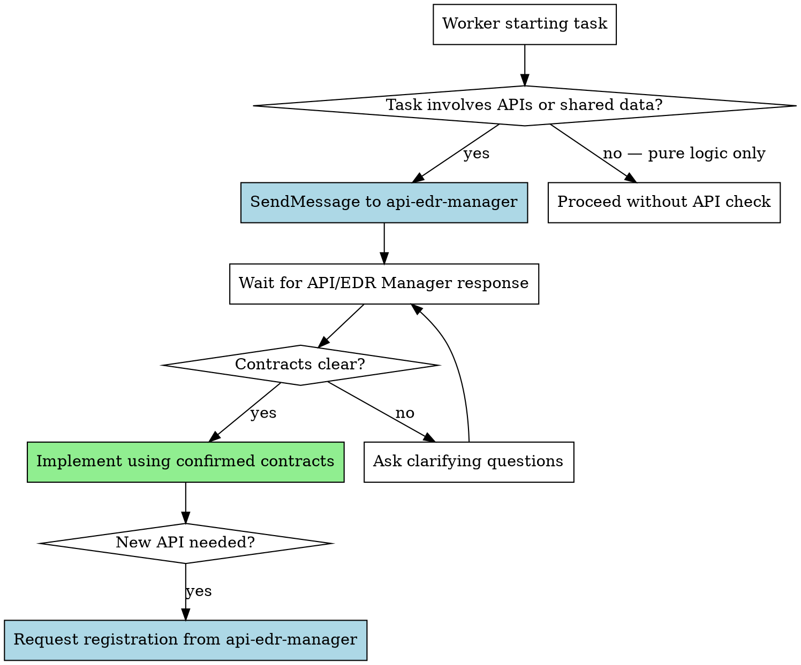

# API/EDR Validation

## Overview

Every agent working on implementation MUST validate API contracts and variable consistency with the API/EDR Manager before writing code. This skill defines the mandatory validation process.

**Core principle:** No agent writes code that touches an API or shared variable without confirming the contract with the API/EDR Manager first.

## When to Use

- Before implementing any task that involves API calls
- Before creating new endpoints or events
- Before using shared variables or data models
- When modifying existing API contracts
- When uncertain about request/response shapes

## The Validation Process



## Worker Query Format

When messaging the API/EDR Manager:

```markdown
API QUERY — Task N: <task title>

I need to know:
1. What endpoints/events are relevant to <functionality>?
2. What are the exact request/response schemas?
3. What shared variables/types should I use?
4. Are there any constraints or edge cases documented?
```

## API/EDR Manager Document Check

The API/EDR Manager follows this process when scanning docs/:

### 1. Check for Existing Documentation

```
docs/
├── api-spec.md          # REST API documentation
├── api-registry.md      # Auto-generated API registry
├── openapi.yaml         # OpenAPI specification
├── events.md            # EDR / event documentation
├── requirements*.md     # Requirements documents (versioned)
└── plans/               # Implementation plans
```

### 2. Build or Update Registry

If `docs/api-registry.md` doesn't exist, create it:

```markdown
# API Registry
> Auto-generated by API/EDR Manager. Do not edit manually.
> Last updated: <timestamp>

## Endpoints
| Method | Path | Description | Request | Response | Source |
|--------|------|-------------|---------|----------|--------|

## Events
| Type | Trigger | Payload | Source |
|------|---------|---------|--------|

## Shared Types
| Name | Definition | Used By |
|------|-----------|---------|

## Variables
| Name | Type | Constraints | Used In |
|------|------|-------------|---------|
```

### 3. Requirements Versioning

When requirements need updating:

1. Copy current version: `docs/requirements-v1.0.md` → `docs/requirements-v1.1.md`
2. Add changelog at top of new version
3. Never delete previous versions
4. Notify Team Lead of version change

## Red Flags

**Never:**
- Implement API calls without checking with API/EDR Manager
- Assume endpoint shapes from memory or convention
- Create duplicate endpoints for the same resource
- Use different variable names for the same concept across tasks
- Modify existing contracts without API/EDR Manager approval

## Integration

**REQUIRED by:**
- **superpowers:team-driven-development** — All workers must follow this skill
- **superpowers:executing-plans** — API validation before implementation

**Works with:**
- **superpowers:audit-verification** — Audit Agent checks API consistency
- **superpowers:verification-before-completion** — Final verification includes API check
