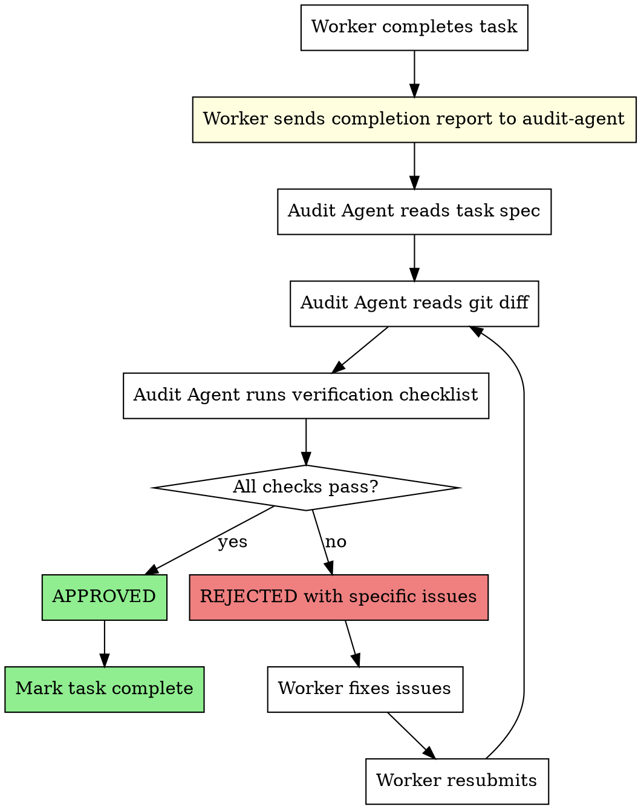

# Audit Verification

## Overview

Every completed task MUST be verified by the Audit Agent before it can be marked as done. This skill defines the mandatory audit process that prevents incomplete or non-compliant work from passing through.

**Core principle:** No task is complete without Audit Agent approval. Self-reporting is insufficient — independent verification is mandatory.

**Announce at start:** "I'm using the audit-verification skill to verify task completion before marking it done."

<HARD-GATE>
You MUST NOT mark any task as "completed" in TaskUpdate without Audit Agent approval.
"The task is obviously correct" is NEVER a valid reason to skip audit.
"It's just a small change" is NEVER a valid reason to skip audit.
The Audit Agent runs on Opus and catches issues that workers miss. Always.
</HARD-GATE>

## When to Use

- After ANY worker completes a task in team-driven-development
- After batch completion in executing-plans
- Before marking any TaskUpdate status to "completed"
- Before proceeding to the next task

## The Audit Gate



## Worker Completion Report Format

Workers MUST send this to the Audit Agent:

```markdown
## Task Completion Report

**Task:** N — <task title>
**Worker:** worker-<number>

### What Was Done
- <bullet list of implemented items>

### Files Changed
- <file paths with brief description of changes>

### Tests
- <number> tests added/modified
- All passing: yes/no
- Command: <test command used>

### API Contracts Used
- <list of endpoints/events used, confirmed with API/EDR Manager>

### Commits
- <commit hashes and messages>
```

## Audit Agent Verification Steps

1. **Read the original task spec** from the implementation plan
2. **Read the git diff** for the worker's commits
3. **Compare spec vs implementation** line by line
4. **Verify tests exist and pass** by running them
5. **Check API consistency** with the API/EDR Manager's registry
6. **Verify no scope creep** — nothing extra beyond spec
7. **Issue verdict:** APPROVED or REJECTED

## Escalation Rules

| Situation | Action |
|-----------|--------|
| First rejection | Worker fixes and resubmits |
| Second rejection (same issue) | Audit Agent notifies Team Lead |
| Third rejection (same task) | Team Lead intervenes — possible task redesign |
| Critical security issue | Broadcast BLOCK to entire team |
| Cross-task conflict | Notify Team Lead + affected workers |

## Red Flags - STOP and Verify

**Never:**
- Skip audit because "it's obvious"
- Let workers mark tasks complete without audit approval
- Accept incomplete completion reports
- Approve without reading the actual git diff
- Rush audit under time pressure

## Integration

**Called by:**
- **superpowers:team-driven-development** — All task completions go through audit
- **superpowers:verification-before-completion** — Audit is part of final verification

**Pairs with:**
- **superpowers:api-edr-validation** — Audit checks API consistency
- **superpowers:test-driven-development** — Audit verifies TDD was followed
