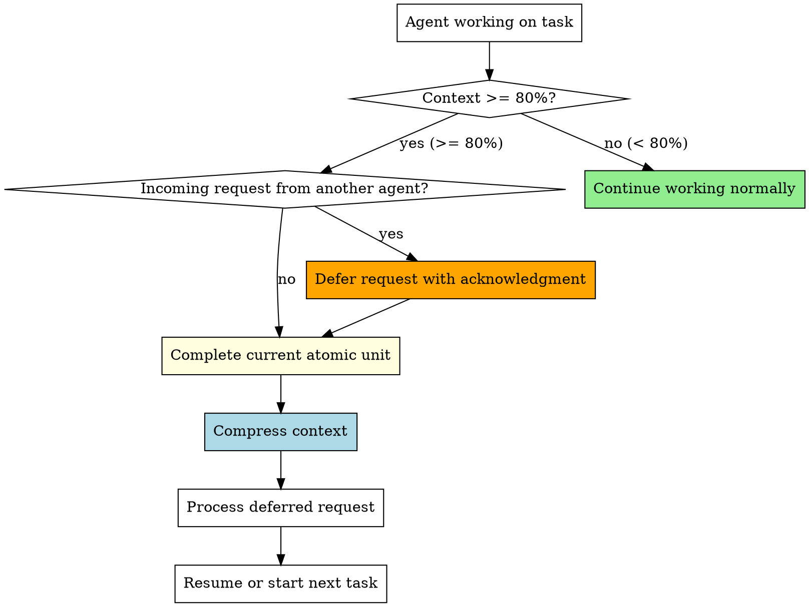

# Context Window Management

## Overview

When an agent's context window reaches 80% capacity, quality degrades — responses become less accurate, instructions get dropped, and critical context is lost. This skill enforces mandatory context compression at the 80% threshold.

**Core principle:** Complete current work unit → compress context → then continue. Never push past 80% without compression.

<HARD-GATE>
When context usage reaches 80%:
1. You MUST complete your current atomic work unit (test, function, commit)
2. You MUST compress context before starting any new work
3. You MUST defer incoming messages until compression is complete
4. You MUST NOT start new tasks while at 80%+
This is non-negotiable. "Just one more thing" is how agents lose critical context.
</HARD-GATE>

## When to Use

This skill applies to ALL agents in a team at ALL times:
- Team Lead monitoring agent health
- Workers during task implementation
- API/EDR Manager during validation rounds
- Audit Agent during verification cycles

## Context Threshold Rules



## Rule 1: The 80% Gate

When your context reaches 80% utilization:

1. **STOP** accepting new work
2. **COMPLETE** your current atomic unit:
   - If writing a test: finish the test
   - If implementing a function: finish the function
   - If in a commit cycle: complete the commit
   - If mid-review: finish the current review item
3. **SAVE STATE** — document what you were doing:
   ```markdown
   ## Context Compression State
   - Task: <current task number and name>
   - Progress: <what's done, what remains>
   - Next step: <exact next action to take>
   - Pending responses: <any deferred messages>
   - Key decisions made: <important context to preserve>
   ```
4. **COMPRESS** — summarize and discard verbose context
5. **RESUME** with the saved state

## Rule 2: Deferring Incoming Requests at 80%+

When context is at 80%+ AND another agent sends you a message:

```
SendMessage to requesting-agent:
  "CONTEXT COMPRESSION IN PROGRESS — Your request is queued.
   I'm completing my current work unit and compressing context.
   Estimated resume: <after compression>.
   Your request will be processed immediately after.
   DO NOT resend — I have it queued."
```

**Priority override:** The ONLY exception is a broadcast with "CRITICAL" or "BLOCK" — these get processed immediately even at 80%+.

## Rule 3: Team Lead Monitoring

The Team Lead SHOULD monitor agent health:

1. If an agent hasn't responded in an unusually long time, check if they're in compression
2. If a worker is consistently hitting 80% on small tasks, consider:
   - Splitting tasks into smaller units
   - Providing less verbose context in task assignments
   - Assigning a fresh worker for remaining tasks

## Context Compression Procedure

### Step 1: Identify Essential Context

Keep only:
- Current task spec (condensed)
- API contracts relevant to current work
- Key decisions and their reasons
- Test results and current state
- File paths being modified

### Step 2: Discard Verbose Context

Remove:
- Full file contents already committed
- Completed task details (summarize to one line each)
- Lengthy discussion threads (keep conclusions only)
- Exploration results that led to dead ends
- Duplicate information

### Step 3: Create Compressed Summary

```markdown
## Compressed Context — <agent-name>

### Current State
- Working on: Task N — <one-line description>
- Progress: Steps 1-3 complete, starting Step 4
- Branch: feature/<name>
- Tests: 12 passing, 0 failing

### Key Context
- API: Using POST /api/users (confirmed with API/EDR Manager)
- Decision: Chose approach B because <reason>
- Blocker: None

### Deferred Messages
- <agent-name>: <one-line summary of their request>

### Next Actions
1. <immediate next step>
2. <following step>
```

## Quick Reference

| Situation | Action |
|-----------|--------|
| Context < 80% | Continue normally |
| Context >= 80%, no incoming | Complete unit → compress → resume |
| Context >= 80%, incoming request | Defer request → complete unit → compress → process request |
| Context >= 80%, CRITICAL broadcast | Process broadcast immediately → compress |
| After compression | Process deferred messages first, then resume task |

## Red Flags

**Never:**
- Start a new task when context is at 80%+
- Ignore the compression threshold
- Lose deferred messages during compression
- Compress without saving state first
- Skip compression because "almost done"
- Let context reach 95%+ under any circumstances

## Integration

**REQUIRED by:**
- **superpowers:team-driven-development** — All team agents follow this skill
- All agents in any team-based workflow

**Works with:**
- **superpowers:audit-verification** — Audit state preserved through compression
- **superpowers:api-edr-validation** — API contracts preserved through compression
