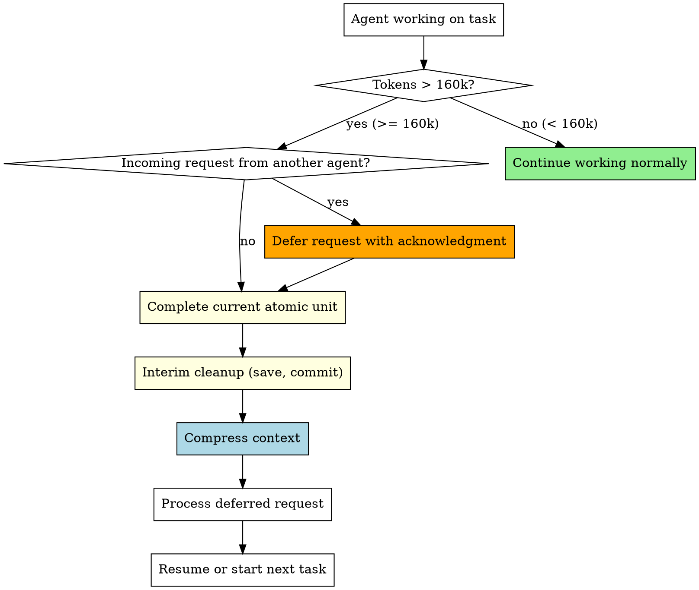

# Context Window Management

## Overview

When an agent's conversation exceeds 160k tokens, quality degrades — responses become less accurate, instructions get dropped, and critical context is lost. This skill enforces mandatory context compression at the 160k token threshold.

**Core principle:** Complete current work unit → interim cleanup → compress context → then continue. Never push past 160k tokens without compression.

**Announce at start:** "I'm using the context-window-management skill to compress context before continuing."

## How to Detect 160k Tokens

Agents cannot directly query their token count. Use these heuristics:

**Estimate your token usage by tracking conversation length:**
- ~4 characters = ~1 token (English), ~2 characters = ~1 token (code-heavy)
- A typical tool call + response = 500-2,000 tokens
- Reading a 200-line file = ~3,000-5,000 tokens
- Each agent turn (thinking + output) = ~1,000-3,000 tokens

**Watch for these system signals that you are approaching the limit:**
- System compresses prior messages automatically (you'll see summarized earlier context)
- Responses start losing track of earlier instructions
- You've had 40+ back-and-forth turns in a conversation
- You've read 15+ files or made 30+ tool calls

**Rule of thumb:** If you've been working for 30+ turns OR the system has auto-compressed once, assume you're at or near 160k and trigger compression.

<HARD-GATE>
When token usage exceeds 160k (or system auto-compression triggers):
1. You MUST complete your current atomic work unit (test, function, commit)
2. You MUST do interim cleanup — save progress, commit work
3. You MUST compress context before starting any new work
4. You MUST defer incoming messages until compression is complete
5. You MUST NOT start new tasks while in compression
This is non-negotiable. "Just one more thing" is how agents lose critical context.
</HARD-GATE>

## When to Use

This skill applies to ALL agents in a team at ALL times:
- Team Lead monitoring agent health
- Workers during task implementation
- API/EDR Manager during validation rounds
- Audit Agent during verification cycles

## Context Threshold Rules



## Rule 1: The 160k Gate

When your conversation exceeds 160k tokens:

1. **STOP** accepting new work
2. **COMPLETE** your current atomic unit:
   - If writing a test: finish the test
   - If implementing a function: finish the function
   - If in a commit cycle: complete the commit
   - If mid-review: finish the current review item
3. **INTERIM CLEANUP** — save all progress:
   - Commit any uncommitted work with a descriptive message
   - Save any pending notes to files
   - Update TaskUpdate with current progress
4. **SAVE STATE** — document what you were doing:
   ```markdown
   ## Context Compression State
   - Task: <current task number and name>
   - Progress: <what's done, what remains>
   - Next step: <exact next action to take>
   - Pending responses: <any deferred messages>
   - Key decisions made: <important context to preserve>
   ```
5. **COMPRESS** — summarize and discard verbose context
6. **RESUME** with the saved state

## Rule 2: Deferring Incoming Requests at 160k+

When tokens exceed 160k AND another agent sends you a message:

```
SendMessage to requesting-agent:
  "CONTEXT COMPRESSION IN PROGRESS — Your request is queued.
   I'm completing my current work unit and compressing context.
   Estimated resume: <after compression>.
   Your request will be processed immediately after.
   DO NOT resend — I have it queued."
```

**Priority override:** The ONLY exception is a broadcast with "CRITICAL" or "BLOCK" — these get processed immediately even at 160k+.

## Rule 3: Team Lead Monitoring

The Team Lead SHOULD monitor agent health:

1. If an agent hasn't responded in an unusually long time, check if they're in compression
2. If a worker is consistently hitting 160k on small tasks, consider:
   - Splitting tasks into smaller units
   - Providing less verbose context in task assignments
   - Assigning a fresh worker for remaining tasks

## Context Compression Procedure

### Step 1: Interim Cleanup

Before compressing, ensure nothing is lost:
- `git add` and `git commit` any pending work
- Update task status in TaskUpdate
- Write any pending findings to files

### Step 2: Identify Essential Context

Keep only:
- Current task spec (condensed)
- API contracts relevant to current work
- Key decisions and their reasons
- Test results and current state
- File paths being modified

### Step 3: Discard Verbose Context

Remove:
- Full file contents already committed
- Completed task details (summarize to one line each)
- Lengthy discussion threads (keep conclusions only)
- Exploration results that led to dead ends
- Duplicate information

### Step 4: Create Compressed Summary

```markdown
## Compressed Context — <agent-name>

### Current State
- Working on: Task N — <one-line description>
- Progress: Steps 1-3 complete, starting Step 4
- Branch: feature/<name>
- Tests: 12 passing, 0 failing

### Key Context
- API: Using POST /api/users (confirmed with API/EDR Manager)
- Decision: Chose approach B because <reason>
- Blocker: None

### Deferred Messages
- <agent-name>: <one-line summary of their request>

### Next Actions
1. <immediate next step>
2. <following step>
```

## Quick Reference

| Situation | Action |
|-----------|--------|
| Tokens < 160k | Continue normally |
| Tokens >= 160k, no incoming | Complete unit → interim cleanup → compress → resume |
| Tokens >= 160k, incoming request | Defer request → complete unit → cleanup → compress → process request |
| Tokens >= 160k, CRITICAL broadcast | Process broadcast immediately → then compress |
| After compression | Process deferred messages first, then resume task |
| System auto-compressed | Treat as 160k threshold hit — do interim cleanup |

## Red Flags - STOP and Compress

**Never:**
- Start a new task when tokens exceed 160k
- Ignore the compression threshold
- Lose deferred messages during compression
- Compress without interim cleanup (commit work first!)
- Skip compression because "almost done"
- Ignore system auto-compression signals

## Integration

**Called by:**
- **superpowers:team-driven-development** — All team agents follow this skill
- All agents in any team-based workflow

**Pairs with:**
- **superpowers:audit-verification** — Audit state preserved through compression
- **superpowers:api-edr-validation** — API contracts preserved through compression
