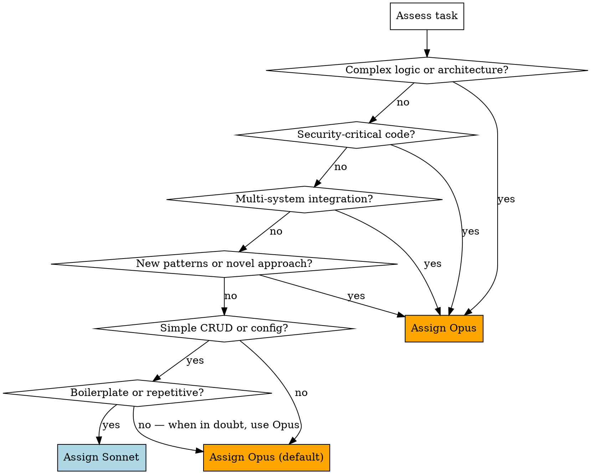

# Model Assignment

## Overview

Not all tasks require the same model capability. This skill defines mandatory rules for which model each agent uses, optimizing cost without sacrificing quality on critical paths.

**Core principle:** Hard tasks get Opus, easy tasks get Sonnet. Audit Agent ALWAYS gets Opus — no exceptions.

**Announce at start:** "I'm using the model-assignment skill to determine the right model for each agent."

## Mandatory Assignments (Non-Negotiable)

| Agent Role | Model | Override Allowed? |
|-----------|-------|-------------------|
| **Audit Agent** | Opus | **NO — always Opus** |
| **Team Lead** | Opus | **NO — always Opus** |

<HARD-GATE>
Audit Agent MUST run on Opus.
"Sonnet is good enough for validation" is NEVER true.
The Audit Agent catches subtle issues that require Opus-level reasoning.
Downgrading it defeats the purpose of having a dedicated validator.
</HARD-GATE>

## Worker Model Assignment

Workers are assigned models based on task difficulty:

## Difficulty Criteria

### High Difficulty → Opus

- New architectural patterns or system design
- Complex business logic with multiple conditions
- Security-critical code (auth, encryption, access control)
- Multi-system integration (API + DB + cache + queue)
- Performance-critical hot paths
- Data migration or schema changes
- Error recovery and fault tolerance
- Concurrent/parallel processing logic
- Tasks with ambiguous requirements needing interpretation

### Low Difficulty → Sonnet

- Simple CRUD operations with clear patterns
- Configuration file changes
- Boilerplate code generation following existing patterns
- Simple test additions following existing test patterns
- CSS/styling changes
- Copy/text updates
- Adding fields to existing forms
- Simple environment variable additions
- README or documentation updates

## Quick Reference

| Task Type | Model | Reason |
|-----------|-------|--------|
| New API endpoint with auth | Opus | Security + integration |
| Add field to existing form | Sonnet | Simple pattern following |
| Database migration | Opus | Data integrity critical |
| Update error message text | Sonnet | Simple text change |
| Implement caching layer | Opus | Architecture decision |
| Add unit test for existing fn | Sonnet | Pattern following |
| WebSocket real-time feature | Opus | Complex concurrency |
| Add route to existing router | Sonnet | Boilerplate |
| Payment processing | Opus | Security + business logic |
| Rename variable across files | Sonnet | Mechanical change |

## When In Doubt

**Default to Opus.** The cost difference is small compared to the cost of a subtle bug from under-powered reasoning. If you're spending more than 10 seconds deciding, just use Opus.

## Red Flags - STOP and Reconsider

**Never:**
- Assign Sonnet to Audit Agent
- Assign Sonnet to security-critical tasks
- Downgrade from Opus mid-task to save cost
- Override mandatory Opus assignments for any reason
- Assign Sonnet when requirements are ambiguous

## Integration

**Called by:**
- **superpowers:team-driven-development** — Model assignment before worker dispatch

**Pairs with:**
- **superpowers:context-window-management** — Model choice affects context efficiency
