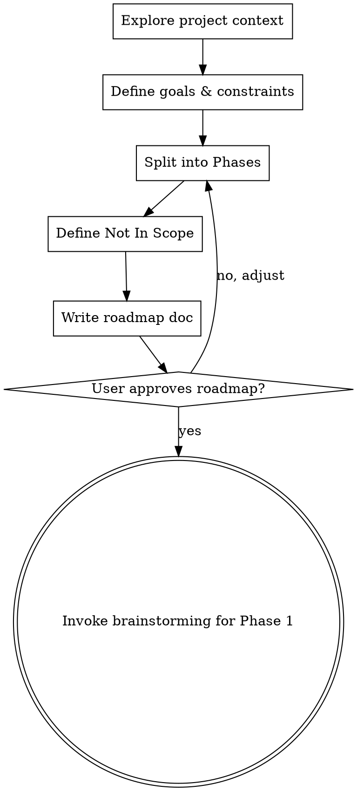

# Project Scoping — Roadmap Before Details

## Overview

대규모 프로젝트에서 brainstorming이 곧바로 세부 스펙으로 들어가는 것을 방지한다.
전체 프로젝트를 Phase로 나누고, 각 Phase의 목표·범위·예상 규모·선행 조건을 정의한 후
brainstorming으로 전환한다.

**Announce at start:** "I'm using the project-scoping skill to define the project roadmap before diving into details."

<HARD-GATE>
이 스킬의 출력물은 로드맵(Phase/목표/범위)뿐이다.
세부 스펙, API 설계, 데이터 모델, 구현 상세는 brainstorming에서 다룬다.
"이 Phase는 간단하니 바로 스펙으로" → STOP. 모든 Phase는 brainstorming을 거친다.
"Phase가 1개뿐이면 이 스킬이 불필요하다" → STOP. 1개라도 목표·범위·Not In Scope를 명확히 한다.
</HARD-GATE>

## When to Use

다음 중 하나에 해당하면 brainstorming 전에 이 스킬을 먼저 실행:
- **신규 프로젝트** 시작
- **대규모 리팩토링** (예상 태스크 10개 이상)
- **대규모 코드 리뷰 수정** (이슈 10개 이상에서 도출된 수정 작업)
- **사용자가 `/project-scoping` 명시적 호출**

다음에는 사용하지 않음:
- 단일 버그 수정, 단일 기능 추가 → brainstorming으로 직행
- 이미 로드맵이 존재하는 프로젝트의 후속 Phase 진행

## Checklist

You MUST create a task for each of these items and complete them in order:

1. **Explore project context** — 기존 코드, docs, CLAUDE.md, 기술 스택, 최근 커밋 확인
2. **Define goals & constraints** — 프로젝트 최종 목표, 기술적/비즈니스 제약, 우선순위 확인 (질문은 한 번에 하나씩)
3. **Split into Phases** — 2~6개 Phase 분할, 각각에 목표/범위/예상 태스크 수/선행 조건 정의
4. **Define Not In Scope** — 이번 프로젝트에서 하지 않을 것 명시
5. **Write roadmap doc** — `docs/plans/YYYY-MM-DD-<project>-roadmap.md`에 저장, git commit
6. **Transition to brainstorming** — 첫 번째 Phase에 대해 brainstorming 스킬 호출

## Process Flow



**The terminal state is invoking brainstorming for Phase 1.** Do NOT invoke writing-plans, team-driven-development, or any implementation skill. The ONLY skill you invoke after project-scoping is brainstorming.

## The Process

**Exploring context:**
- Check out the current project state (files, docs, CLAUDE.md, recent commits)
- Identify tech stack, existing architecture, key modules
- Check if docs/api/ exists and review existing contracts

**Defining goals & constraints:**
- Ask one question at a time to clarify the project's ultimate goal
- Identify technical constraints (existing schema, backward compatibility, etc.)
- Identify business constraints (timeline, priorities, resources)
- Prefer multiple choice questions when possible

**Splitting into Phases:**
- Each Phase should be independently deliverable (shippable increment)
- Phase boundaries should align with natural system boundaries (modules, layers)
- Each Phase should have a clear goal achievable in one brainstorming + implementation cycle
- Estimate task count roughly (brainstorming will refine)
- Define dependencies between Phases

**Defining Not In Scope:**
- Explicitly list what this project will NOT do
- This prevents scope creep during brainstorming and implementation
- Be specific: "모바일 앱" not "기타 기능"

## Roadmap Document Format

```markdown
# <Project Name> Roadmap

> Created: YYYY-MM-DD
> Status: Active

## 목표
<프로젝트의 최종 목표 1-2문장>

## 제약조건
- <기술적 제약>
- <비즈니스 제약>

## Phase 1: <Phase 이름>
- **목표**: <한 문장 — 이 Phase가 완료되면 무엇이 달성되는가>
- **범위**: <영향받는 모듈/디렉토리>
- **예상 태스크 수**: N개
- **선행 조건**: 없음

## Phase 2: <Phase 이름>
- **목표**: <한 문장>
- **범위**: <모듈/디렉토리>
- **예상 태스크 수**: N개
- **선행 조건**: Phase 1 완료

## Not In Scope
- <하지 않을 것 1>
- <하지 않을 것 2>
```

## After the Roadmap

**Phase별 진행:**
- 로드맵 승인 후, Phase 1부터 순차적으로 brainstorming → writing-plans → team-driven-development 진행
- 각 Phase 완료 후 다음 Phase의 brainstorming 시작
- brainstorming 시 로드맵 문서를 참조하여 해당 Phase의 범위 내에서만 진행

## Key Principles

- **로드맵은 전체 그림** — 세부는 brainstorming에서
- **Phase는 독립 배포 단위** — 각 Phase가 끝나면 동작하는 결과물
- **One question at a time** — 질문은 하나씩
- **Not In Scope가 핵심** — 범위 밖을 정의해야 범위 안이 명확해짐
- **2~6 Phases** — 너무 적으면 의미 없고, 너무 많으면 로드맵 자체가 복잡

## Red Flags — STOP and Follow Process

| Thought | Reality |
|---------|---------|
| "Phase가 1개뿐이다" | 1개라도 목표/범위/Not In Scope를 명확히 한다. |
| "이 Phase의 세부 스펙을 여기서 정하자" | 세부 스펙은 brainstorming의 몫. 로드맵은 목표/범위만. |
| "바로 brainstorming 해도 될 것 같다" | 대규모 프로젝트면 로드맵 먼저. 범위 없이 설계하면 범위 초과. |
| "Phase 간 의존성이 복잡하다" | Phase를 재분할하거나 합쳐서 단순화한다. |
| "Not In Scope는 나중에 정하자" | Not In Scope는 지금 정해야 한다. 나중에 정하면 이미 범위에 들어왔다. |
