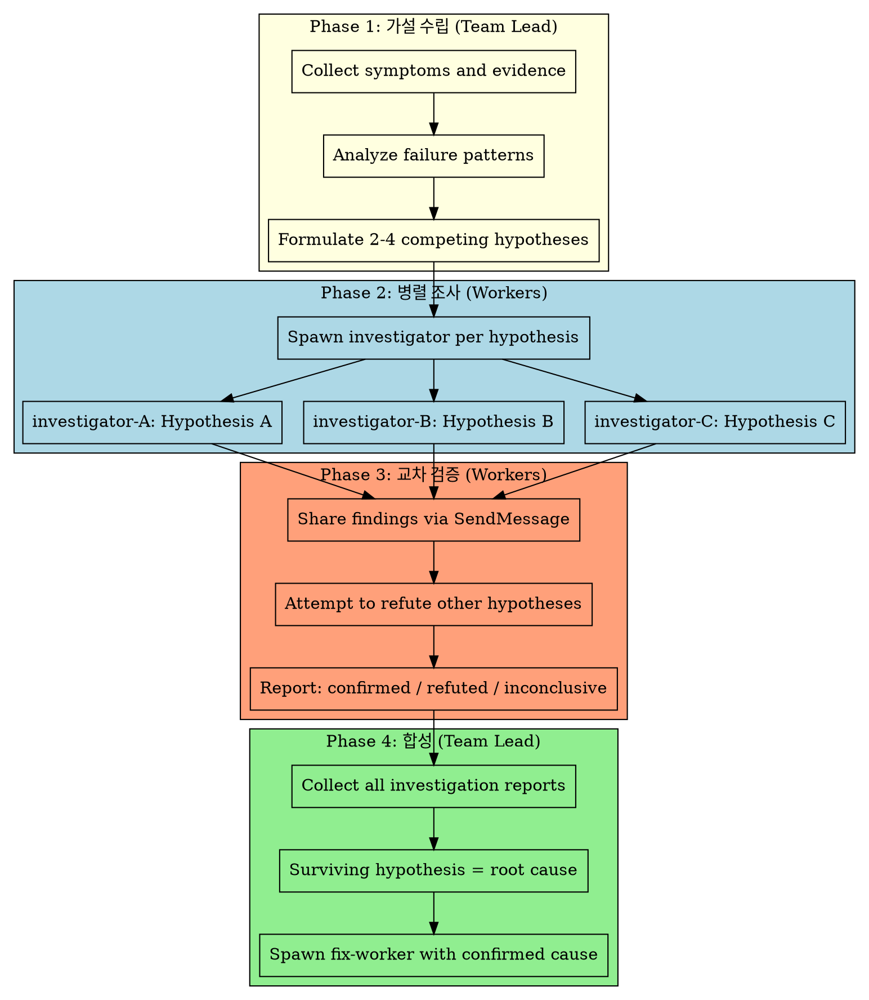

# Competing Hypotheses

팀 디버깅 모드에서 사용하는 병렬 가설 검증 패턴입니다. 단일 에이전트로 해결이 어려운 복잡한 버그에 대해, 여러 Worker가 각각 다른 가설을 동시에 조사합니다.

## 전체 흐름



## Phase 1: 가설 수립

**Team Lead가 수행합니다.**

1. **증상 수집** — 에러 메시지, 스택 트레이스, 재현 조건, 실패 패턴을 정리합니다
2. **실패 패턴 분석** — 어떤 조건에서 실패하고 어떤 조건에서 성공하는지 파악합니다
3. **경쟁 가설 수립** — 2~4개의 서로 다른 근본 원인 가설을 작성합니다

### 가설 작성 형식

```markdown
## Hypothesis [A/B/C/D]: [가설 제목]

**주장:** [근본 원인이 무엇이라고 생각하는지]
**근거:** [이 가설을 지지하는 관찰된 증거]
**예측:** [이 가설이 맞다면 관찰될 추가 현상]
**반증 조건:** [이 가설이 틀리다면 발견될 것]
**조사 방향:** [확인해야 할 코드/로그/설정]
```

### 가설 수립 원칙

- 가설은 **상호 배타적**이어야 합니다 (동시에 모두 참일 수 없음)
- 각 가설은 **검증 가능**해야 합니다 (코드 분석으로 확인/반증 가능)
- **가장 가능성 높은 것**부터 **가장 낮은 것**까지 정렬합니다
- 최소 하나는 **비직관적 가설**을 포함합니다 (명백한 것만 보면 편향)

## Phase 2: 병렬 조사

**가설당 1명의 Worker를 스폰합니다.**

### Worker 스폰 규칙

- **이름**: `[topic]-investigator` (예: `auth-investigator`, `cache-investigator`, `race-condition-investigator`)
- **모델**: Opus (디버깅 조사에는 항상 Opus)
- **범위**: 코드 읽기 + 분석만 (수정 금지)

### Worker 프롬프트 템플릿

```
You are [topic]-investigator. Your task is to investigate ONE hypothesis:

HYPOTHESIS: [가설 전문]

YOUR MISSION:
1. Investigate ONLY this hypothesis — gather evidence for AND against
2. Read relevant source code, logs, and configurations
3. Trace data flow related to this hypothesis
4. DO NOT modify any files — read only
5. When done, report your findings to Team Lead with:
   - Evidence supporting the hypothesis
   - Evidence against the hypothesis
   - Your conclusion: CONFIRMED / REFUTED / INCONCLUSIVE
   - If confirmed: exact root cause location (file:line)

IMPORTANT: Be objective. Try to DISPROVE your hypothesis, not just confirm it.
Confirmation bias is the enemy of debugging.
```

### 병렬 조사 원칙

- 각 Investigator는 **자기 가설만** 조사합니다
- 코드는 **읽기만** 합니다 (수정 금지 — 수정은 Phase 4 이후)
- **시간 제한**: 조사가 너무 길어지면 중간 보고를 요청합니다

## Phase 3: 교차 검증

**Workers 간 직접 메시지로 발견을 공유하고 상호 반박을 시도합니다.**

1. **발견 공유** — 각 Investigator가 다른 Investigator에게 자신의 핵심 발견을 SendMessage로 공유합니다
2. **반박 시도** — 다른 가설의 발견을 보고, 자신의 조사 결과로 반박할 수 있는지 확인합니다
3. **최종 보고** — 각 Investigator가 Team Lead에게 최종 판정을 보고합니다:

### 최종 보고 형식

```markdown
## Investigation Report: Hypothesis [A/B/C]

**Verdict:** CONFIRMED / REFUTED / INCONCLUSIVE

### Supporting Evidence
- [발견 1 — 파일:라인 참조]
- [발견 2 — 파일:라인 참조]

### Contradicting Evidence
- [반증 1]
- [반증 2]

### Cross-Validation Notes
- [다른 Investigator의 발견과의 관계]
- [상호 반박 결과]

### Root Cause (if confirmed)
- **Location:** [file:line]
- **Mechanism:** [어떻게 버그가 발생하는지]
- **Fix Direction:** [수정 방향 제안]
```

## Phase 4: 합성

**Team Lead가 수행합니다.**

1. **모든 보고서 수집** — 각 Investigator의 최종 보고를 수집합니다
2. **합성 판단**:
   - **하나만 CONFIRMED** → 그것이 근본 원인. Fix Worker 스폰
   - **여러 개 CONFIRMED** → 복합 원인. 가설을 결합하여 통합 Fix Worker 스폰
   - **모두 REFUTED** → 새로운 가설 필요. Phase 1로 돌아감
   - **모두 INCONCLUSIVE** → 추가 증거 수집 필요. 범위를 좁혀서 재조사

3. **Fix Worker 스폰** — 확인된 근본 원인을 수정할 Worker를 스폰합니다
   - 역할명 기반 이름 사용 (예: `auth-fix-worker`)
   - 근본 원인 위치와 메커니즘을 프롬프트에 포함
   - `superpowers:test-driven-development` 사용하여 수정

4. **모든 Investigator 종료** — 조사 완료된 Investigator들을 shutdown합니다

## 사용 조건

이 패턴은 다음 조건을 **모두** 만족할 때 사용합니다:

- 경쟁 가설이 3개 이상 존재
- 영향 범위가 넓어 단일 에이전트로 조사하기 어려움
- 3회 이상 수정 시도가 실패했거나, 근본 원인을 특정하지 못함

**사용하지 않을 때:**
- 가설이 1-2개뿐인 단순한 버그 → 일반 systematic-debugging으로 충분
- 재현 자체가 안 되는 경우 → 먼저 재현 환경을 구축
- 인프라/환경 문제가 명확한 경우 → 직접 조사
