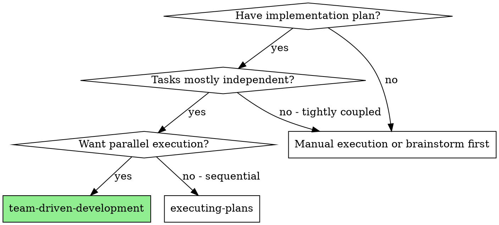
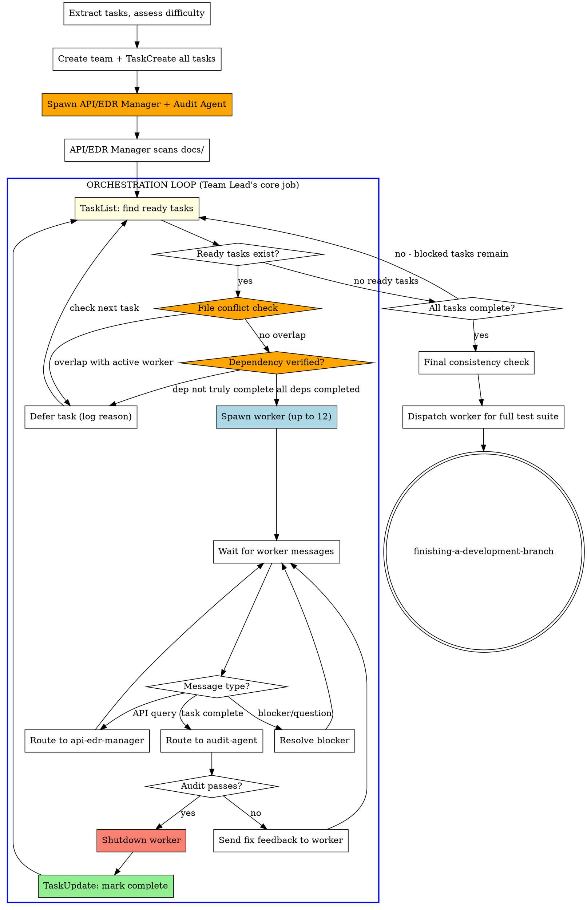

# Team-Driven Development

Execute plan by creating an agent team with dedicated roles, **dynamic on-demand worker spawning**, mandatory API/EDR validation, and audit verification after each task.

**Core principle:** Team Lead runs an orchestration loop — spawning workers when tasks are ready, shutting them down when done. Workers are ephemeral: spawn per task, terminate after audit approval. Dedicated roles (API manager + audit agent) persist throughout.

**Announce at start:** "I'm using the team-driven-development skill to execute this plan with an agent team."

<HARD-GATE>
You (Team Lead) MUST NOT write any code directly.
Your ONLY job is the ORCHESTRATION LOOP:
- Check TaskList for ready tasks (unblocked, no owner)
- Spawn a worker ON DEMAND for each ready task
- Route messages between agents (worker ↔ api-edr-manager ↔ audit-agent)
- Shutdown completed workers via SendMessage type: "shutdown_request"
- Resolve blockers by coordinating agents
- Make architectural decisions when asked by your human partner or workers

"Let me just write this one small thing" is NEVER acceptable.
"It's faster if I do it myself" is NEVER acceptable.
"Let me spawn all workers before checking readiness" is NEVER acceptable — always verify file conflicts + dependencies first, THEN spawn all verified-ready tasks (up to 12).
"I'll wait for the worker" and then do other work is NEVER acceptable — stay in the loop.
If no worker is available, spawn a new worker. Never code yourself.

After spawning mandatory agents and completing API/EDR scan, you enter the loop and NEVER leave it until all tasks are complete. Every turn you take MUST be one of:
1. Checking TaskList for ready tasks
2. Verifying file conflicts and dependencies before spawning
3. Spawning a worker for a verified-safe task
4. Routing a message between agents
5. Shutting down a completed worker
6. Resolving a blocker (including spin detection escalation to human partner)

If you find yourself doing ANYTHING else, STOP. You have left the loop.
</HARD-GATE>

## When to Use



## Mandatory Team Roles

| Role | Model | Responsibility | Writes Code? |
|------|-------|----------------|:---:|
| **Team Lead (You)** | Opus | Orchestration ONLY — assign tasks, route messages, resolve blockers | **NO — NEVER** |
| **API/EDR Manager** | Opus (mandatory) | Validate API contracts, EDR docs, variable consistency | NO |
| **Audit Agent** | Opus (mandatory) | Verify task completion against spec, block non-compliant work | NO |
| **Worker(s)** | Opus (hard) / Sonnet (easy) | Implement tasks following TDD | **YES — only role that writes code** |

<HARD-GATE>
You MUST NOT skip API/EDR Manager or Audit Agent roles when creating the team.
Every team MUST include both roles regardless of project size or perceived simplicity.
"This project doesn't need API validation" is NEVER a valid reason to skip.
</HARD-GATE>

## Worker Lifecycle: Spawn → Work → Audit → Shutdown

Workers are **ephemeral** — one worker per task, terminated after audit approval.

```
Worker lifecycle:
  SPAWN  →  Worker created for specific task
  WORK   →  Query API/EDR Manager → Implement with TDD
  AUDIT  →  Send to audit-agent → Pass/Fail loop
  SHUTDOWN → SendMessage type: "shutdown_request" → Worker exits
```

**Why ephemeral workers?**
- Prevents resource waste from idle agents
- Each worker gets clean context for its task
- Team Lead maintains control of execution flow
- Failed workers can be replaced without side effects

## The Process



## Step-by-Step Execution

**Steps 1-4 (Setup):** See `setup-guide.md` — team creation, task registration, mandatory agent spawning, API scan, difficulty assessment.

**Step 5 (Orchestration Loop):** See `orchestration-loop.md` — the full 8-step loop with file conflict checks, dependency verification, spawn/route/audit/shutdown cycle, spin detection.

**Worker spawn template:** See `worker-spawn-template.md`.

### Step 6: Final Gates

After all tasks (use TaskList to confirm all tasks are marked complete):
1. Send message to `api-edr-manager`: "All tasks complete. Perform final cross-task consistency check."
2. Send message to `audit-agent`: "All tasks complete. Perform final comprehensive verification."
3. Spawn a NEW worker to run the full test suite (you MUST NOT run tests yourself)
4. After test suite passes, shutdown all remaining agents (api-edr-manager, audit-agent)
5. Use superpowers:finishing-a-development-branch

## Quick Reference

| Situation | Action |
|-----------|--------|
| Task ready (unblocked, no owner) | File conflict check → dependency check → spawn worker |
| Worker sends API query | Forward to api-edr-manager, relay response back |
| Worker reports task complete | Forward summary to audit-agent |
| Audit passes | Shutdown worker → mark task complete → check TaskList |
| Audit rejects | Forward feedback to worker → wait for fix |
| Worker reports blocker | Resolve and respond, or escalate to human |
| Worker requests out-of-scope file | Update target_files, check conflicts, then approve |
| DEFER_STREAK = 3 | Deadlock — escalate to human partner immediately |
| All tasks complete | Final gates: consistency check → full test suite → finish branch |

## Red Flags - STOP and Correct

**Never:**
- **Team Lead writes code directly** — spawn a worker instead, always
- **Spawn all workers upfront** — spawn on demand, one per ready task
- **Leave completed workers running** — shutdown immediately after audit approval
- **Leave the orchestration loop** — every turn must be a loop action
- **Do "quick work" while waiting** — your job is routing and spawning, nothing else
- **Spawn workers with overlapping target files** — file conflict check is mandatory before every spawn
- **Skip dependency verification** — always confirm blockedBy tasks are truly completed
- **Let workers modify files outside their scope** — reject and reassign if worker requests out-of-scope files
- **Ignore spin detection** — if all tasks are deferred 3 cycles, escalate to human immediately
- Create team without API/EDR Manager and Audit Agent
- Let workers skip the API validation query
- Mark tasks complete without audit-agent approval
- Use Sonnet for API/EDR Manager or Audit Agent
- Start workers before API/EDR Manager completes initial scan
- Let workers assume API contracts without confirmation
- Skip the final consistency check
- Proceed when audit-agent reports failures
- Register tasks without target_files metadata

**Rationalization table:**

| Excuse | Reality |
|--------|---------|
| "Let me spawn all workers now for speed" | Wastes resources. Spawn when task is ready. |
| "I'll do this one thing while waiting" | You are NOT waiting. You are routing messages. |
| "The worker is idle, no need to shut down" | Idle workers consume context. Shutdown after audit. |
| "I'll batch the shutdowns later" | Shutdown immediately. Each completed worker frees resources. |
| "It's more efficient to keep workers alive" | Workers have task-specific context. Fresh workers are cleaner. |
| "These tasks probably don't touch the same files" | Probably ≠ verified. Always check target_files overlap. |
| "The dependency is obvious, no need to verify" | Obvious ≠ confirmed. TaskGet the blockedBy task to verify status. |
| "The worker needs just one more file outside scope" | Update target_files, check conflicts, THEN approve. Never skip. |
| "It'll resolve itself eventually" | 3 cycles with no progress = deadlock. Escalate now. |

**If worker exceeds 160k tokens:**
- **REQUIRED:** Use superpowers:context-window-management
- Complete current unit of work, do interim cleanup, compress context, then continue

## Integration

**Called by:**
- **writing-plans** (Execution Handoff) - REQUIRED when team-driven execution chosen
- Your human partner requesting parallel team execution

**Pairs with:**
- **using-git-worktrees** - REQUIRED: Set up isolated workspace before starting
- **api-edr-validation** - REQUIRED: Code-writing workers follow this skill
- **audit-verification** - REQUIRED: All task completions go through audit
- **model-assignment** - REQUIRED: Determines worker model assignment
- **context-window-management** - REQUIRED: All agents follow context rules
- **test-driven-development** - Workers follow TDD for each task
- **finishing-a-development-branch** - Complete development after all tasks

**Replaces:**
- **subagent-driven-development** - DEPRECATED: Team-driven is the preferred approach
