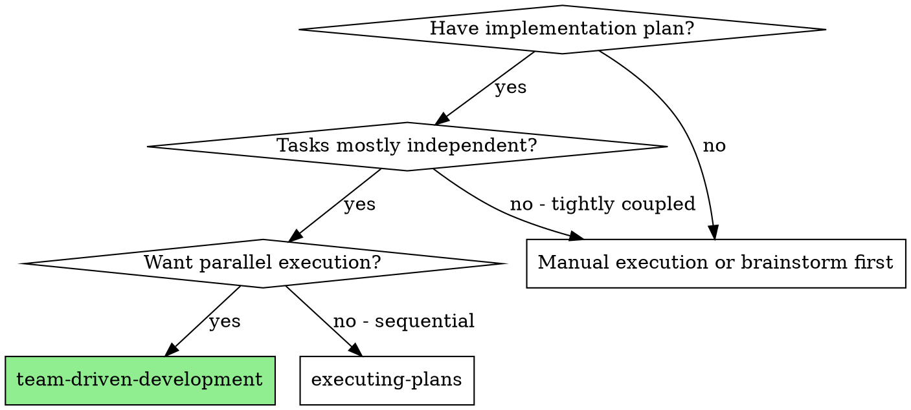
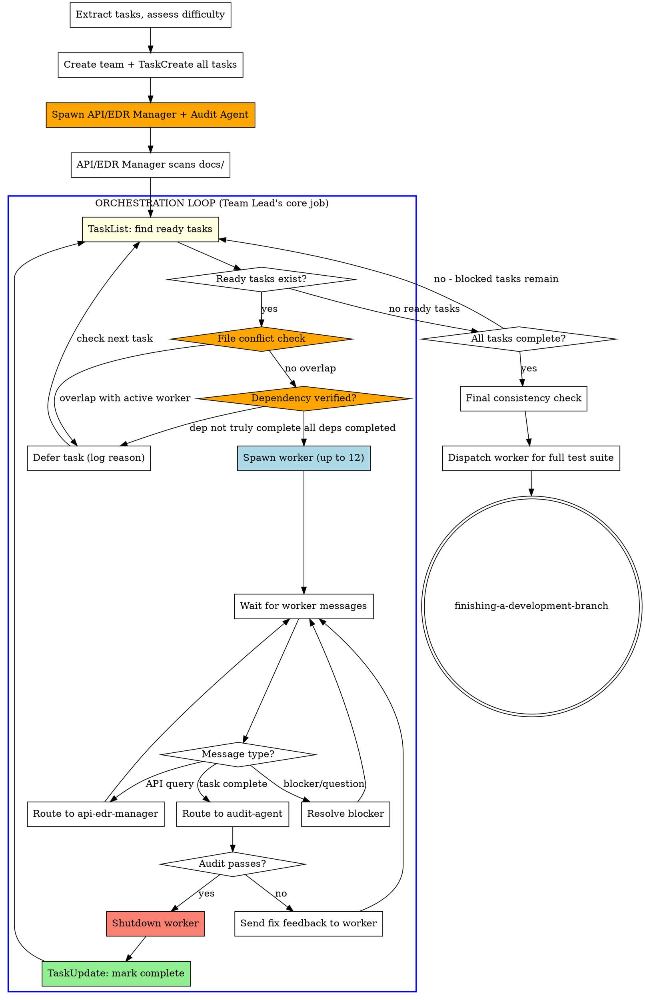

# Team-Driven Development

Execute plan by creating an agent team with dedicated roles, **dynamic on-demand worker spawning**, mandatory API/EDR validation, and audit verification after each task.

**Core principle:** Team Lead runs an orchestration loop — spawning workers when tasks are ready, shutting them down when done. Workers are ephemeral: spawn per task, terminate after audit approval. Dedicated roles (API manager + audit agent) persist throughout.

**Announce at start:** "I'm using the team-driven-development skill to execute this plan with an agent team."

<HARD-GATE>
You (Team Lead) MUST NOT write any code directly.
Your ONLY job is the ORCHESTRATION LOOP:
- Check TaskList for ready tasks (unblocked, no owner)
- Spawn a worker ON DEMAND for each ready task
- Route messages between agents (worker ↔ api-edr-manager ↔ audit-agent)
- Shutdown completed workers via SendMessage type: "shutdown_request"
- Resolve blockers by coordinating agents
- Make architectural decisions when asked by your human partner or workers

"Let me just write this one small thing" is NEVER acceptable.
"It's faster if I do it myself" is NEVER acceptable.
"Let me spawn all workers before checking readiness" is NEVER acceptable — always verify file conflicts + dependencies first, THEN spawn all verified-ready tasks (up to 12).
"I'll wait for the worker" and then do other work is NEVER acceptable — stay in the loop.
If no worker is available, spawn a new worker. Never code yourself.
</HARD-GATE>

## When to Use



**vs. Subagent-Driven Development:**
- Team-based coordination (TeamCreate + SendMessage) instead of disposable subagents
- Dedicated API/EDR manager validates all API contracts before and during work
- Audit agent verifies every completed task against spec
- True parallel execution across multiple workers
- Persistent team context throughout the project lifecycle

## Mandatory Team Roles

| Role | Model | Responsibility | Writes Code? |
|------|-------|----------------|:---:|
| **Team Lead (You)** | Opus | Orchestration ONLY — assign tasks, route messages, resolve blockers | **NO — NEVER** |
| **API/EDR Manager** | Opus (mandatory) | Validate API contracts, EDR docs, variable consistency | NO |
| **Audit Agent** | Opus (mandatory) | Verify task completion against spec, block non-compliant work | NO |
| **Worker(s)** | Opus (hard) / Sonnet (easy) | Implement tasks following TDD | **YES — only role that writes code** |

<HARD-GATE>
You MUST NOT skip API/EDR Manager or Audit Agent roles when creating the team.
Every team MUST include both roles regardless of project size or perceived simplicity.
"This project doesn't need API validation" is NEVER a valid reason to skip.
</HARD-GATE>

## Worker Lifecycle: Spawn → Work → Audit → Shutdown

Workers are **ephemeral** — one worker per task, terminated after audit approval.

```
Worker lifecycle:
  SPAWN  →  Worker created for specific task
  WORK   →  Query API/EDR Manager → Implement with TDD
  AUDIT  →  Send to audit-agent → Pass/Fail loop
  SHUTDOWN → SendMessage type: "shutdown_request" → Worker exits
```

**Why ephemeral workers?**
- Prevents resource waste from idle agents
- Each worker gets clean context for its task
- Team Lead maintains control of execution flow
- Failed workers can be replaced without side effects

## The Process



<HARD-GATE>
**THE ORCHESTRATION LOOP IS YOUR ENTIRE JOB.**
After spawning mandatory agents and completing API/EDR scan, you enter the loop and NEVER leave it until all tasks are complete.
Every turn you take MUST be one of:
1. Checking TaskList for ready tasks
2. Verifying file conflicts and dependencies before spawning
3. Spawning a worker for a verified-safe task
4. Routing a message between agents
5. Shutting down a completed worker
6. Resolving a blocker (including spin detection escalation to human partner)

If you find yourself doing ANYTHING else, STOP. You have left the loop.
</HARD-GATE>

## Step-by-Step Execution

### Step 1: Create Team & Register All Tasks

```
TeamCreate:
  team_name: "<project-name>"
  description: "Implementing <feature>"
```

**Immediately after TeamCreate**, register ALL tasks from the plan using TaskCreate:

```
For each task in plan:
  TaskCreate:
    subject: "<task title>"
    description: "<full task requirements including target files>"
    activeForm: "<present continuous form>"
    metadata: { "target_files": ["src/auth.ts", "src/auth.test.ts"] }

Then set dependencies:
  TaskUpdate: { taskId: "2", addBlockedBy: ["1"] }  # if task 2 depends on task 1
```

**CRITICAL — target_files metadata:**
Every task MUST declare which files it will create or modify in `metadata.target_files`.
This is used by the orchestration loop to prevent file conflicts between concurrent workers.

**CRITICAL — dependency analysis:**
Before entering the loop, verify the dependency graph is correct:
1. Tasks that share target files MUST have a dependency (blockedBy) between them
2. Tasks that consume output of another task MUST be blocked by that task
3. Circular dependencies MUST be resolved by splitting tasks

This gives you a complete task board with dependency graph and file ownership BEFORE any agent is spawned.

### Step 2: Spawn Mandatory Agents (Only These)

**Only spawn infrastructure agents — NO workers yet:**

```
Task (API/EDR Manager):
  name: "api-edr-manager"
  subagent_type: "sonbbal-superpowers:api-edr-manager"
  model: "opus"                    # ALWAYS Opus — non-negotiable
  prompt: "You are the API/EDR Manager. See agents/api-edr-manager.md for your role."
  team_name: "<project-name>"

Task (Audit Agent):
  name: "audit-agent"
  subagent_type: "sonbbal-superpowers:audit-agent"
  model: "opus"                    # ALWAYS Opus — non-negotiable
  prompt: "You are the Audit Agent. See agents/audit-agent.md for your role."
  team_name: "<project-name>"
```

### Step 3: API/EDR Manager Initial Scan

Before entering the orchestration loop:

1. Send message to `api-edr-manager`: "Scan docs/ for API and EDR documents. Build the API registry."
2. Wait for the API/EDR Manager to respond with the registry
3. If no docs found: API/EDR Manager creates `docs/api-registry.md` as baseline
4. If docs found: API/EDR Manager indexes all endpoints, variables, contracts

### Step 4: Assess Task Difficulty

Use **superpowers:model-assignment** to determine model for each task:

| Difficulty | Criteria | Model |
|-----------|----------|-------|
| **High** | New architecture, complex logic, security-critical, multi-system integration | Opus |
| **Low** | Simple CRUD, config changes, boilerplate, straightforward tests | Sonnet |

Record the model assignment in task metadata:
```
TaskUpdate: { taskId: "1", metadata: { "model": "opus" } }
TaskUpdate: { taskId: "2", metadata: { "model": "sonnet" } }
```

### Step 5: Enter the Orchestration Loop

<HARD-GATE>
From this point forward, you are IN THE LOOP. You do NOT leave the loop until all tasks are complete.
Every single turn MUST be one of the loop actions below. No exceptions.
</HARD-GATE>

**The loop:**

```
REPEAT until all tasks are completed:

  Track DEFER_STREAK counter (starts at 0):
  - Increment when ALL ready tasks are deferred in a cycle
  - Reset to 0 when a new worker is spawned OR a task is completed
    OR an active worker sends a message

  1. CHECK READY TASKS:
     TaskList → find tasks with status "pending", no owner, empty blockedBy

  2. FILE CONFLICT CHECK (before spawning):
     Maintain an ACTIVE FILE LOCK TABLE (mental or noted):
     - When spawning a worker: add its target_files to the lock table
     - When shutting down a worker: remove its target_files from the lock table
     - This avoids re-fetching metadata.target_files via TaskGet every cycle
     For each ready task, compare its metadata.target_files against the lock table:
     - If ANY target file overlaps with an active worker's task → DO NOT spawn, skip this task
     - Only spawn tasks whose target_files have ZERO overlap with active workers
     - Log skipped tasks: "Task N deferred — file conflict with worker-M on <file>"

  3. DEPENDENCY VERIFICATION (before spawning):
     For each ready task, verify:
     - ALL blockedBy tasks have status "completed" (not just "in_progress")
     - If a blockedBy task failed audit and is being reworked → task stays blocked
     - Double-check: TaskGet each blockedBy task to confirm completion

  4. SPAWN: For each ready task that passed conflict + dependency checks (up to 12 concurrent):
     - Spawn ONE worker per task
     - Set task owner to worker name
     - TaskUpdate: { taskId: N, status: "in_progress", owner: "worker-N" }

  5. WAIT: For worker messages (automatic delivery)

  6. ROUTE: Based on message content:
     - API query → Forward to api-edr-manager, relay response back to worker
     - Task complete → Forward summary to audit-agent
     - Blocker/question → Resolve and respond to worker
     - File conflict reported → STOP worker, resolve conflict, then resume

  7. AUDIT RESULT:
     - If audit-agent APPROVES:
       a. Shutdown worker: SendMessage type: "shutdown_request" to worker
       b. TaskUpdate: { taskId: N, status: "completed" }
       c. Go to step 1 (completed task may unblock others + free file locks)
     - If audit-agent REJECTS:
       a. Forward rejection feedback to worker
       b. Go to step 5 (wait for worker's fix)

  8. DYNAMIC SCALING:
     - If a blocked task becomes unblocked (dependency completed) → check file conflicts → spawn if clear
     - If worker is stuck > 3 messages without progress → investigate, consider replacing
     - If new task discovered during work → TaskCreate with target_files + dependencies → add to loop
     - If file conflict resolved (worker shutdown) → re-check deferred tasks for spawning
     - SPIN DETECTION: If DEFER_STREAK reaches 3 (no new workers spawned,
       no tasks completed, AND no active worker messages received during
       those cycles), PAUSE the loop and escalate as blocker resolution
       (permitted action #6):
       a. Report the deadlock to your human partner with details
       b. List which tasks are deferred and why (file conflicts or dependency issues)
       c. Ask for guidance: split tasks, reorder dependencies, or force-proceed
       After receiving guidance, reset DEFER_STREAK to 0 and return to Step 1.
```

**Max concurrent workers:** Spawn up to 12 workers in parallel for independent tasks. When one completes and shuts down, its file locks are released and deferred tasks become eligible for spawning.

### Worker Spawn Template

```
Task (Worker):
  name: "worker-<task-id>"
  subagent_type: "general-purpose"
  model: "<opus or sonnet from task metadata>"
  prompt: |
    You are worker-<task-id>. Your SINGLE task:

    Task: <full task text from TaskGet>
    Target files: <list from metadata.target_files>

    MANDATORY WORKFLOW:
    1. FIRST: SendMessage to api-edr-manager asking for API contracts relevant to your task
    2. WAIT for api-edr-manager's response before writing ANY code
    3. Follow TDD: write failing test FIRST, then implement minimal code to pass
       (REQUIRED SUB-SKILL: superpowers:test-driven-development)
    4. Implement using ONLY confirmed API contracts and variable names
    5. If new API needed: request api-edr-manager to register it BEFORE using it
    6. When DONE: SendMessage to audit-agent with Task Completion Report:
       - What Was Done (bullet list)
       - Files Changed (paths + description)
       - Tests (count, all passing yes/no, command used)
       - API Contracts Used (confirmed with api-edr-manager)
       - Commits (hashes and messages)
    7. If audit-agent rejects: fix and resubmit
    8. NEVER mark task complete yourself — Team Lead handles that after audit approval

    FILE SCOPE RESTRICTION:
    - You may ONLY modify files listed in your target files
    - If you need to modify a file NOT in your target list, STOP and message Team Lead
    - Team Lead will update your task's target_files and check for conflicts before approving
    - NEVER modify files outside your scope — this causes conflicts with other workers

    NEVER assume API shapes or invent variable names — always confirm with api-edr-manager.
  team_name: "<project-name>"
```

### Worker Shutdown Protocol

When audit-agent approves a worker's task:

```
1. SendMessage type: "shutdown_request" to worker-N
   content: "Task N approved by audit. Great work. Shutting down."
2. Worker responds with shutdown_response (approve: true)
3. TaskUpdate: { taskId: N, status: "completed" }
4. Worker process terminates — resources freed
5. Immediately check TaskList for next ready task
```

**If worker rejects shutdown** (still has work):
- Investigate — did audit miss something?
- If worker is wrong, re-send shutdown_request with explanation
- If worker is right, let it finish and re-route to audit

### Step 6: Final Gates

After all tasks (use TaskList to confirm all tasks are marked complete):
1. Send message to `api-edr-manager`: "All tasks complete. Perform final cross-task consistency check."
2. Send message to `audit-agent`: "All tasks complete. Perform final comprehensive verification."
3. Spawn a NEW worker to run the full test suite (you MUST NOT run tests yourself)
4. After test suite passes, shutdown all remaining agents (api-edr-manager, audit-agent)
5. Use superpowers:finishing-a-development-branch

## Red Flags - STOP and Correct

**Never:**
- **Team Lead writes code directly** — spawn a worker instead, always
- **Spawn all workers upfront** — spawn on demand, one per ready task
- **Leave completed workers running** — shutdown immediately after audit approval
- **Leave the orchestration loop** — every turn must be a loop action
- **Do "quick work" while waiting** — your job is routing and spawning, nothing else
- **Spawn workers with overlapping target files** — file conflict check is mandatory before every spawn
- **Skip dependency verification** — always confirm blockedBy tasks are truly completed
- **Let workers modify files outside their scope** — reject and reassign if worker requests out-of-scope files
- **Ignore spin detection** — if all tasks are deferred 3 cycles, escalate to human immediately
- Create team without API/EDR Manager and Audit Agent
- Let workers skip the API validation query
- Mark tasks complete without audit-agent approval
- Use Sonnet for API/EDR Manager or Audit Agent
- Start workers before API/EDR Manager completes initial scan
- Let workers assume API contracts without confirmation
- Skip the final consistency check
- Proceed when audit-agent reports failures
- Register tasks without target_files metadata

**Rationalization table:**

| Excuse | Reality |
|--------|---------|
| "Let me spawn all workers now for speed" | Wastes resources. Spawn when task is ready. |
| "I'll do this one thing while waiting" | You are NOT waiting. You are routing messages. |
| "The worker is idle, no need to shut down" | Idle workers consume context. Shutdown after audit. |
| "I'll batch the shutdowns later" | Shutdown immediately. Each completed worker frees resources. |
| "It's more efficient to keep workers alive" | Workers have task-specific context. Fresh workers are cleaner. |
| "These tasks probably don't touch the same files" | Probably ≠ verified. Always check target_files overlap. |
| "The dependency is obvious, no need to verify" | Obvious ≠ confirmed. TaskGet the blockedBy task to verify status. |
| "The worker needs just one more file outside scope" | Update target_files, check conflicts, THEN approve. Never skip. |
| "It'll resolve itself eventually" | 3 cycles with no progress = deadlock. Escalate now. |

**If worker exceeds 160k tokens:**
- **REQUIRED:** Use superpowers:context-window-management
- Complete current unit of work, do interim cleanup, compress context, then continue

## Integration

**Called by:**
- **writing-plans** (Execution Handoff) - REQUIRED when team-driven execution chosen
- Your human partner requesting parallel team execution

**Pairs with:**
- **using-git-worktrees** - REQUIRED: Set up isolated workspace before starting
- **api-edr-validation** - REQUIRED: Code-writing workers follow this skill
- **audit-verification** - REQUIRED: All task completions go through audit
- **model-assignment** - REQUIRED: Determines worker model assignment
- **context-window-management** - REQUIRED: All agents follow context rules
- **test-driven-development** - Workers follow TDD for each task
- **finishing-a-development-branch** - Complete development after all tasks

**Replaces:**
- **subagent-driven-development** - DEPRECATED: Team-driven is the preferred approach
