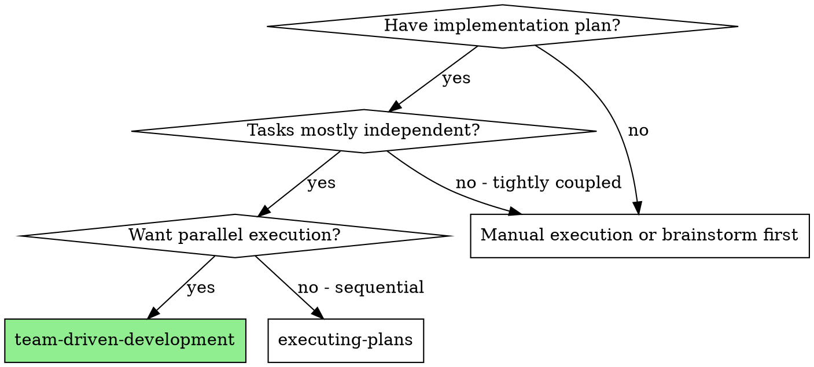

# Team-Driven Development

Execute plan by creating an agent team with dedicated roles, parallel task execution, mandatory API/EDR validation, and audit verification after each task.

**Core principle:** Team Lead orchestrates only, never writes code. Workers implement. Dedicated roles (API manager + audit agent) enforce quality gates. Parallel execution for speed.

**Announce at start:** "I'm using the team-driven-development skill to execute this plan with an agent team."

<HARD-GATE>
You (Team Lead) MUST NOT write any code directly.
Your ONLY job is orchestration:
- Create and manage the team
- Assign tasks to workers
- Route messages between agents
- Resolve blockers by coordinating agents
- Make architectural decisions when asked by your human partner or workers

"Let me just write this one small thing" is NEVER acceptable.
"It's faster if I do it myself" is NEVER acceptable.
If no worker is available, spawn a new worker. Never code yourself.
</HARD-GATE>

## When to Use



**vs. Subagent-Driven Development:**
- Team-based coordination (TeamCreate + SendMessage) instead of disposable subagents
- Dedicated API/EDR manager validates all API contracts before and during work
- Audit agent verifies every completed task against spec
- True parallel execution across multiple workers
- Persistent team context throughout the project lifecycle

## Mandatory Team Roles

| Role | Model | Responsibility | Writes Code? |
|------|-------|----------------|:---:|
| **Team Lead (You)** | Opus | Orchestration ONLY — assign tasks, route messages, resolve blockers | **NO — NEVER** |
| **API/EDR Manager** | Opus (mandatory) | Validate API contracts, EDR docs, variable consistency | NO |
| **Audit Agent** | Opus (mandatory) | Verify task completion against spec, block non-compliant work | NO |
| **Worker(s)** | Opus (hard) / Sonnet (easy) | Implement tasks following TDD | **YES — only role that writes code** |

<HARD-GATE>
You MUST NOT skip API/EDR Manager or Audit Agent roles when creating the team.
Every team MUST include both roles regardless of project size or perceived simplicity.
"This project doesn't need API validation" is NEVER a valid reason to skip.
</HARD-GATE>

## The Process

```dot
digraph process {
    rankdir=TB;

    "Extract tasks, assess difficulty" [shape=box];
    "Create team (TeamCreate)" [shape=box];
    "Spawn API/EDR Manager + Audit Agent" [shape=box style=filled fillcolor=orange];
    "API/EDR Manager scans docs/" [shape=box];
    "API/EDR docs exist?" [shape=diamond];
    "Create API registry" [shape=box];
    "Index existing docs" [shape=box];
    "Assign workers (model-assignment)" [shape=box];

    subgraph cluster_per_task {
        label="Per Task (parallel where independent)";
        "Worker receives task" [shape=box];
        "Query API/EDR Manager" [shape=box style=filled fillcolor=lightblue];
        "Get confirmed contracts" [shape=box style=filled fillcolor=lightblue];
        "Implement with TDD" [shape=box];
        "Send completion to Audit Agent" [shape=box];
        "Audit passes?" [shape=diamond];
        "Fix and resubmit" [shape=box];
        "Task approved" [shape=box style=filled fillcolor=lightgreen];
    }

    "All tasks complete?" [shape=diamond];
    "Final consistency check" [shape=box];
    "Dispatch worker for full test suite" [shape=box];
    "finishing-a-development-branch" [shape=doublecircle];

    "Extract tasks, assess difficulty" -> "Create team (TeamCreate)";
    "Create team (TeamCreate)" -> "Spawn API/EDR Manager + Audit Agent";
    "Spawn API/EDR Manager + Audit Agent" -> "API/EDR Manager scans docs/";
    "API/EDR Manager scans docs/" -> "API/EDR docs exist?";
    "API/EDR docs exist?" -> "Index existing docs" [label="yes"];
    "API/EDR docs exist?" -> "Create API registry" [label="no"];
    "Index existing docs" -> "Assign workers (model-assignment)";
    "Create API registry" -> "Assign workers (model-assignment)";
    "Assign workers (model-assignment)" -> "Worker receives task";
    "Worker receives task" -> "Query API/EDR Manager";
    "Query API/EDR Manager" -> "Get confirmed contracts";
    "Get confirmed contracts" -> "Implement with TDD";
    "Implement with TDD" -> "Send completion to Audit Agent";
    "Send completion to Audit Agent" -> "Audit passes?";
    "Audit passes?" -> "Fix and resubmit" [label="no"];
    "Fix and resubmit" -> "Implement with TDD";
    "Audit passes?" -> "Task approved" [label="yes"];
    "Task approved" -> "All tasks complete?";
    "All tasks complete?" -> "Worker receives task" [label="no"];
    "All tasks complete?" -> "Final consistency check" [label="yes"];
    "Final consistency check" -> "Dispatch worker for full test suite";
    "Dispatch worker for full test suite" -> "finishing-a-development-branch";
}
```



## Step-by-Step Execution

### Step 1: Create Team

```
TeamCreate:
  team_name: "<project-name>"
  description: "Implementing <feature>"
```

### Step 2: Spawn Mandatory Agents

**Always spawn these first — before any worker:**

```
Task (API/EDR Manager):
  name: "api-edr-manager"
  subagent_type: "general-purpose"
  model: "opus"                    # ALWAYS Opus — non-negotiable
  prompt: "You are the API/EDR Manager. See agents/api-edr-manager.md for your role."
  team_name: "<project-name>"

Task (Audit Agent):
  name: "audit-agent"
  subagent_type: "general-purpose"
  model: "opus"                    # ALWAYS Opus — non-negotiable
  prompt: "You are the Audit Agent. See agents/audit-agent.md for your role."
  team_name: "<project-name>"
```

### Step 3: API/EDR Manager Initial Scan

Before dispatching any worker:

1. Send message to `api-edr-manager`: "Scan docs/ for API and EDR documents. Build the API registry."
2. Wait for the API/EDR Manager to respond with the registry
3. If no docs found: API/EDR Manager creates `docs/api-registry.md` as baseline
4. If docs found: API/EDR Manager indexes all endpoints, variables, contracts

### Step 4: Assess Task Difficulty & Assign Models

Use **superpowers:model-assignment** to determine model for each worker:

| Difficulty | Criteria | Model |
|-----------|----------|-------|
| **High** | New architecture, complex logic, security-critical, multi-system integration | Opus |
| **Low** | Simple CRUD, config changes, boilerplate, straightforward tests | Sonnet |

### Step 5: Dispatch Workers (Parallel)

For each independent task group:

```
Task (Worker):
  name: "worker-<task-number>"
  subagent_type: "general-purpose"
  model: "<opus or sonnet per difficulty>"
  prompt: |
    Task: <full task text>
    MANDATORY: Before writing ANY code, send a message to api-edr-manager
    asking for the API contracts relevant to your task.
    After completion, send your work summary to audit-agent for verification.
  team_name: "<project-name>"
```

### Step 6: Code-Writing Worker API Validation Loop

```
EVERY code-writing worker MUST:
1. SendMessage to api-edr-manager: "I'm working on Task N. What APIs/variables apply?"
2. WAIT for api-edr-manager's response
3. Implement using ONLY confirmed API contracts and variable names
4. If new API needed: request api-edr-manager to register it BEFORE using it
5. NEVER assume API shapes or invent variable names — always confirm with api-edr-manager
6. NEVER declare new API endpoints or EDR variables without api-edr-manager approval
```

**Why this matters:** Agents frequently invent API endpoints, variable names, and request/response shapes on their own. This causes cross-task inconsistencies, broken integrations, and wasted debugging time. The API/EDR Manager is the single source of truth for all API contracts and variable declarations.

### Step 7: Audit Verification Loop

```
EVERY worker MUST after completing a task:
1. SendMessage to audit-agent: "Task N complete. Summary: <what was done>"
2. WAIT for audit-agent's verification
3. If audit-agent rejects: fix issues and resubmit
4. If audit-agent approves: mark task complete
5. NEVER mark task complete without audit-agent approval
```

### Step 8: Final Gates

After all tasks (use TaskList to confirm all tasks are marked complete):
1. Send message to `api-edr-manager`: "All tasks complete. Perform final cross-task consistency check."
2. Send message to `audit-agent`: "All tasks complete. Perform final comprehensive verification."
3. Dispatch a worker to run the full test suite (you MUST NOT run tests yourself)
4. Use superpowers:finishing-a-development-branch

## Red Flags - STOP and Correct

**Never:**
- **Team Lead writes code directly** — spawn a worker instead, always
- Create team without API/EDR Manager and Audit Agent
- Let workers skip the API validation query
- Mark tasks complete without audit-agent approval
- Use Sonnet for API/EDR Manager or Audit Agent
- Start workers before API/EDR Manager completes initial scan
- Let workers assume API contracts without confirmation
- Skip the final consistency check
- Proceed when audit-agent reports failures

**If worker exceeds 160k tokens:**
- **REQUIRED:** Use superpowers:context-window-management
- Complete current unit of work, do interim cleanup, compress context, then continue

## Integration

**Called by:**
- **writing-plans** (Execution Handoff) - REQUIRED when team-driven execution chosen
- Your human partner requesting parallel team execution

**Pairs with:**
- **using-git-worktrees** - REQUIRED: Set up isolated workspace before starting
- **api-edr-validation** - REQUIRED: Code-writing workers follow this skill
- **audit-verification** - REQUIRED: All task completions go through audit
- **model-assignment** - REQUIRED: Determines worker model assignment
- **context-window-management** - REQUIRED: All agents follow context rules
- **test-driven-development** - Workers follow TDD for each task
- **finishing-a-development-branch** - Complete development after all tasks

**Replaces:**
- **subagent-driven-development** - DEPRECATED: Team-driven is the preferred approach
