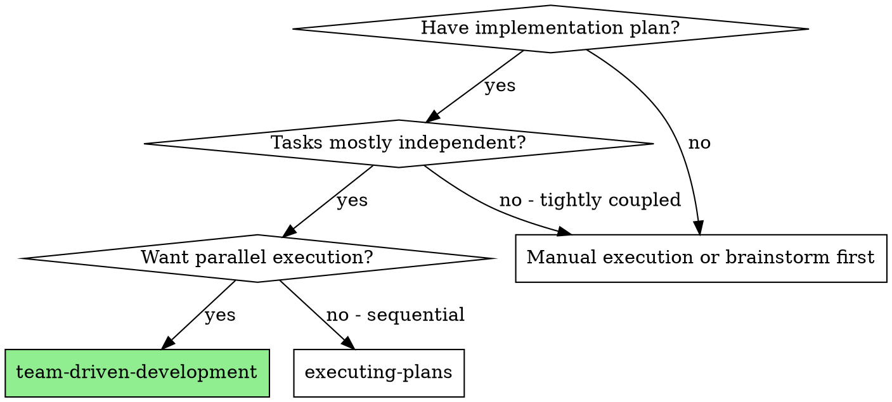
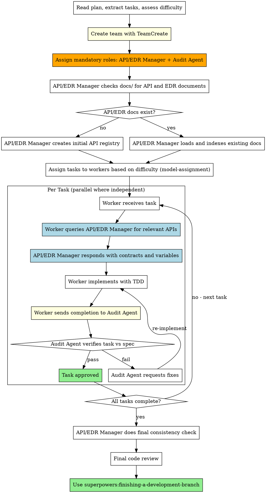

# Team-Driven Development

Execute plan by creating an agent team with dedicated roles, parallel task execution, mandatory API/EDR validation, and audit verification after each task.

**Core principle:** Agent team with dedicated roles (API manager + audit agent + workers) + parallel execution + mandatory gates = high quality, fast delivery

## When to Use



**vs. Subagent-Driven Development:**
- Team-based coordination (TeamCreate + SendMessage) instead of disposable subagents
- Dedicated API/EDR manager validates all API contracts before and during work
- Audit agent verifies every completed task against spec
- True parallel execution across multiple workers
- Persistent team context throughout the project lifecycle

## Mandatory Team Roles

| Role | Model | Responsibility |
|------|-------|----------------|
| **Team Lead** | Opus | Orchestrates tasks, manages team, resolves blockers |
| **API/EDR Manager** | Opus (mandatory) | Validates API contracts, EDR docs, variable consistency |
| **Audit Agent** | Opus (mandatory) | Verifies task completion against spec, blocks non-compliant work |
| **Worker(s)** | Opus (hard) / Sonnet (easy) | Implements tasks following TDD |

<HARD-GATE>
You MUST NOT skip API/EDR Manager or Audit Agent roles when creating the team.
Every team MUST include both roles regardless of project size or perceived simplicity.
"This project doesn't need API validation" is NEVER a valid reason to skip.
</HARD-GATE>

## The Process



## Step-by-Step Execution

### Step 1: Create Team

```
TeamCreate:
  team_name: "<project-name>"
  description: "Implementing <feature>"
```

### Step 2: Spawn Mandatory Agents

**Always spawn these first — before any worker:**

```
Task (API/EDR Manager):
  name: "api-edr-manager"
  subagent_type: "general-purpose"
  model: "opus"                    # ALWAYS Opus — non-negotiable
  prompt: "You are the API/EDR Manager. See agents/api-edr-manager.md for your role."
  team_name: "<project-name>"

Task (Audit Agent):
  name: "audit-agent"
  subagent_type: "general-purpose"
  model: "opus"                    # ALWAYS Opus — non-negotiable
  prompt: "You are the Audit Agent. See agents/audit-agent.md for your role."
  team_name: "<project-name>"
```

### Step 3: API/EDR Manager Initial Scan

Before dispatching any worker:

1. Send message to `api-edr-manager`: "Scan docs/ for API and EDR documents. Build the API registry."
2. Wait for the API/EDR Manager to respond with the registry
3. If no docs found: API/EDR Manager creates `docs/api-registry.md` as baseline
4. If docs found: API/EDR Manager indexes all endpoints, variables, contracts

### Step 4: Assess Task Difficulty & Assign Models

Use **superpowers:model-assignment** to determine model for each worker:

| Difficulty | Criteria | Model |
|-----------|----------|-------|
| **High** | New architecture, complex logic, security-critical, multi-system integration | Opus |
| **Low** | Simple CRUD, config changes, boilerplate, straightforward tests | Sonnet |

### Step 5: Dispatch Workers (Parallel)

For each independent task group:

```
Task (Worker):
  name: "worker-<task-number>"
  subagent_type: "general-purpose"
  model: "<opus or sonnet per difficulty>"
  prompt: |
    Task: <full task text>
    MANDATORY: Before writing ANY code, send a message to api-edr-manager
    asking for the API contracts relevant to your task.
    After completion, send your work summary to audit-agent for verification.
  team_name: "<project-name>"
```

### Step 6: Worker API Validation Loop

```
EVERY worker MUST:
1. SendMessage to api-edr-manager: "I'm working on Task N. What APIs/variables apply?"
2. WAIT for api-edr-manager's response
3. Implement using confirmed API contracts
4. If new API needed: request api-edr-manager to register it
5. NEVER assume API shapes — always confirm with api-edr-manager
```

### Step 7: Audit Verification Loop

```
EVERY worker MUST after completing a task:
1. SendMessage to audit-agent: "Task N complete. Summary: <what was done>"
2. WAIT for audit-agent's verification
3. If audit-agent rejects: fix issues and resubmit
4. If audit-agent approves: mark task complete
5. NEVER mark task complete without audit-agent approval
```

### Step 8: Final Gates

After all tasks:
1. API/EDR Manager performs final cross-task consistency check
2. Audit Agent performs final comprehensive verification
3. Run full test suite
4. Use superpowers:finishing-a-development-branch

## Red Flags

**Never:**
- Create team without API/EDR Manager and Audit Agent
- Let workers skip the API validation query
- Mark tasks complete without audit-agent approval
- Use Sonnet for API/EDR Manager or Audit Agent
- Start workers before API/EDR Manager completes initial scan
- Let workers assume API contracts without confirmation
- Skip the final consistency check
- Proceed when audit-agent reports failures

**If worker hits 80% context:**
- **REQUIRED:** Use superpowers:context-window-management
- Complete current unit of work, compress, then continue

## Integration

**Required workflow skills:**
- **superpowers:using-git-worktrees** — REQUIRED: Set up isolated workspace before starting
- **superpowers:writing-plans** — Creates the plan this skill executes
- **superpowers:api-edr-validation** — REQUIRED: API/EDR Manager follows this skill
- **superpowers:audit-verification** — REQUIRED: Audit Agent follows this skill
- **superpowers:model-assignment** — REQUIRED: Determines worker model assignment
- **superpowers:context-window-management** — REQUIRED: All agents follow context rules
- **superpowers:finishing-a-development-branch** — Complete development after all tasks

**Each worker should use:**
- **superpowers:test-driven-development** — Workers follow TDD for each task

**Replaces:**
- **superpowers:subagent-driven-development** — Team-driven is the preferred approach for parallel work
