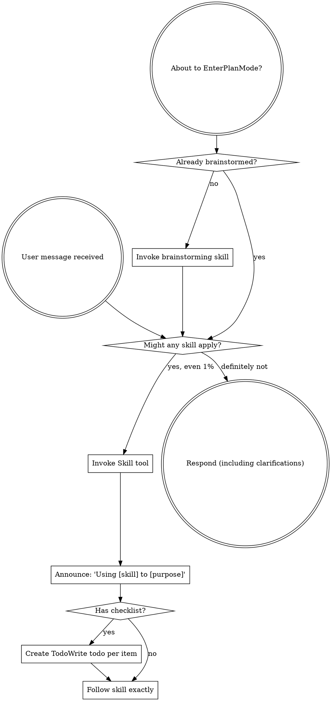

<EXTREMELY-IMPORTANT>
If you think there is even a 1% chance a skill might apply to what you are doing, you ABSOLUTELY MUST invoke the skill.

IF A SKILL APPLIES TO YOUR TASK, YOU DO NOT HAVE A CHOICE. YOU MUST USE IT.

This is not negotiable. This is not optional. You cannot rationalize your way out of this.
</EXTREMELY-IMPORTANT>

## How to Access Skills

**In Claude Code:** Use the `Skill` tool. When you invoke a skill, its content is loaded and presented to you—follow it directly. Never use the Read tool on skill files.

**In other environments:** Check your platform's documentation for how skills are loaded.

# Using Skills

## The Rule

**Invoke relevant or requested skills BEFORE any response or action.** Even a 1% chance a skill might apply means that you should invoke the skill to check. If an invoked skill turns out to be wrong for the situation, you don't need to use it.

## Red Flags

These thoughts mean STOP—you're rationalizing:

| Thought | Reality |
|---------|---------|
| "This is just a simple question" | Questions are tasks. Check for skills. |
| "I need more context first" | Skill check comes BEFORE clarifying questions. |
| "Let me explore the codebase first" | Skills tell you HOW to explore. Check first. |
| "I can check git/files quickly" | Files lack conversation context. Check for skills. |
| "Let me gather information first" | Skills tell you HOW to gather information. |
| "This doesn't need a formal skill" | If a skill exists, use it. |
| "I remember this skill" | Skills evolve. Read current version. |
| "This doesn't count as a task" | Action = task. Check for skills. |
| "The skill is overkill" | Simple things become complex. Use it. |
| "I'll just do this one thing first" | Check BEFORE doing anything. |
| "This feels productive" | Undisciplined action wastes time. Skills prevent this. |
| "I know what that means" | Knowing the concept ≠ using the skill. Invoke it. |

## Skill Priority

When multiple skills could apply, use this order:

1. **Scoping skills first** (project-scoping) - for large projects, define roadmap before details
2. **Process skills second** (brainstorming, debugging) - these determine HOW to approach the task
3. **Team & validation skills third** (team-driven-development, api-edr-validation, model-assignment) - these set up execution infrastructure
4. **Implementation skills fourth** (frontend-design, mcp-builder) - these guide execution
5. **Quality gate skills always** (audit-verification, context-window-management) - these run continuously

"Let's build X" (large project) → project-scoping first, then brainstorming per Phase, then team setup.
"Let's build X" (small feature) → brainstorming first, then team setup with audit agent.
"Fix this bug" → debugging first, then domain-specific skills.
"Execute this plan" → team-driven-development with mandatory audit gates.

## Skill Types

**Rigid** (TDD, debugging, audit-verification, api-edr-validation, context-window-management): Follow exactly. Don't adapt away discipline.

**Flexible** (patterns): Adapt principles to context.

**Mandatory team roles** (audit-agent): ALWAYS present in team-driven-development. Never optional.

The skill itself tells you which.

## Team Lead Rule

When using team-driven-development, you act as **Team Lead — orchestration only**.

**The Team Lead MUST NOT:**
- Write, edit, or generate any code directly
- Use Edit, Write, or NotebookEdit tools for code files
- "Fix a quick thing" instead of dispatching a worker

**The Team Lead MUST:**
- Create teams, assign tasks, route messages
- Resolve blockers by coordinating between agents
- Make architectural decisions when workers ask
- Spawn new workers if no worker is available

## User Instructions

Instructions say WHAT, not HOW. "Add X" or "Fix Y" doesn't mean skip workflows.

## Direct Conversation Rule

사용자와 직접 대화하는 세션에서 (team-driven-development의 워커가 아닌 경우):

<HARD-GATE>
코드 변경(Edit, Write, NotebookEdit)이 필요한 요청을 받으면:
1. 먼저 분석 결과와 변경 계획을 제시한다
2. 사용자의 명시적 승인("진행해", "go ahead", "approved", "해줘" 등)을 기다린다
3. 승인 후에만 Edit/Write/NotebookEdit를 실행한다

"간단한 수정"도 예외 없이 이 순서를 따른다.
"사용자가 수정을 요청했으니 바로 하면 된다" → STOP. 계획 제시가 먼저다.
</HARD-GATE>

**예외 (이 규칙이 적용되지 않는 경우):**
- team-driven-development 내 워커 에이전트 (오케스트레이터가 관리)
- 사용자가 "바로 수정해줘", "즉시 적용해" 등 명시적 즉시 실행 요청
- 오타 수정 등 사용자가 구체적 변경 내용을 직접 지정한 경우

| Thought | Reality |
|---------|---------|
| "사용자가 수정 요청했으니 바로 하자" | 요청 ≠ 승인. 계획 제시가 먼저. |
| "이건 한 줄 수정이라 계획이 필요 없다" | 한 줄도 계획 제시 → 승인 → 실행. |
| "물어보면 답과 함께 수정하는 게 빠르다" | 사용자는 답만 원했을 수 있다. |
| "이전에 비슷한 수정을 승인했으니" | 이전 승인 ≠ 현재 승인. 매번 확인. |
